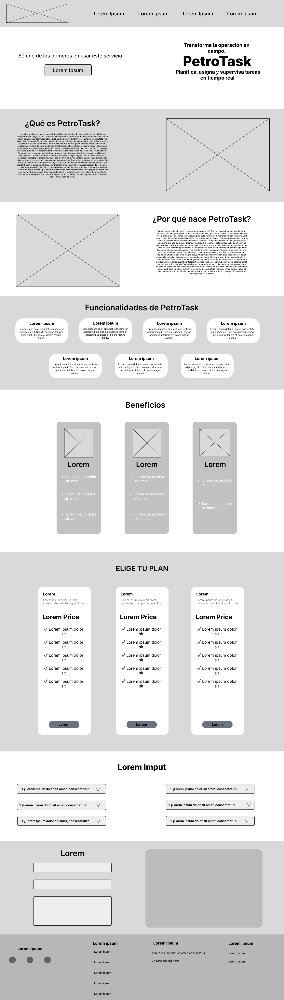
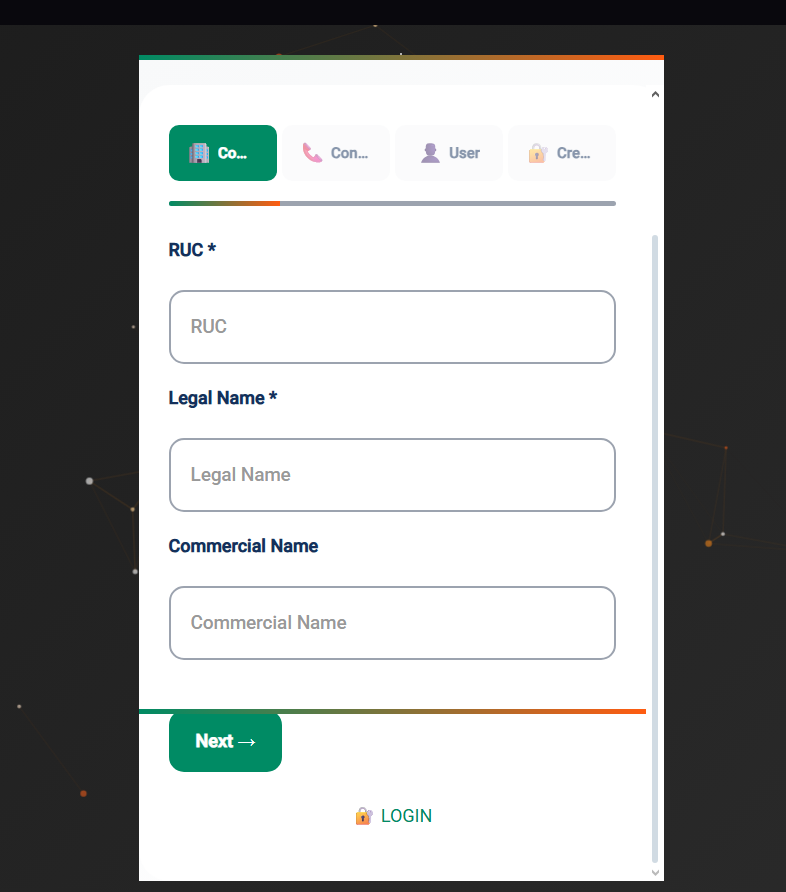

# Informe del Trabajo Final

<div>
  <p align="center"></p>
  <p align="center"><b>Informe de Trabajo Final</b></p>
  <p align="center">Facultad de Ingeniería</p>
  <p align="center">Universidad Peruana de Ciencias Aplicadas</p>
  <p align="center">Ingeniería de Software</p>
  <p align="center">Desarrollo de Aplicaciones Open Source - 1ASI0729</p>
  <p align="center">NRC: 7349</p>
  <p align="center">Efraín Ricardo Bautista Ubillús</p>
  <p align="center">Startup: PetroTask</p>
  <p align="center">Producto: PetroTask</p>
</div>

---

## Team members:

| **Nombre**                         | **Código** |
| ---------------------------------- | ---------- |
| Oskar Rodrigo Sosa Soto            | U202212214 |
| Rodrigo Fabrizio Aguilar Untiveros | U202318309 |
| Santiago Valentino Solis Chang     | U20231B475 |
| Johan Giovani Huamán Cuba          | u202417448 |

<div>
  <p align="center"><b>Ciclo 2025 - 20</b></p>
</div>

## Versiones del Informe

| _Versión_ | _Fecha_    | _Autor_                         | _Descripción de modificación_               |
| --------- | ---------- | ------------------------------- | ------------------------------------------- |
| 1.0       | 11/09/2025 | Baldeon Vivar, Santiago Armando | Creación del repositorio                    |
| 1.1       | 18/09/2025 | Todos                           | Completo cap 2,3,4,5                        |
| 1.2       | 08/10/2025 | Todos                           | Sprint 2 y correcciones                     |
| 1.3       | 15/11/2025 | Todos                           | Sprint 3, correcciones y avance del backend |

## Project Report Collaboration Insights

URL del repositorio para el reporte del proyecto: [Click aquí](https://github.com/PetroTask/PetroTask-report)

**TB1**

Para el desarrollo de la parte del informe correspondiente a la TB1, se dividió la implementación de secciones de la siguiente forma entre los integrantes del grupo:

| **Integrantes**                    | **Tareas asignadas**                                                                                                                                                                                                                                                                                                 |
| ---------------------------------- | -------------------------------------------------------------------------------------------------------------------------------------------------------------------------------------------------------------------------------------------------------------------------------------------------------------------- |
| Baldeón Vivar, Santiago Armando    | Canvas, Diseño de entrevistas, style guidelines, wireframes, mockup, class dictionary, Source Code Style Guide & Conventions, Sprint Backlog 1, edición del video                                                                                                                                                    |
| Oskar Rodrigo Sosa Soto            | Antescedentes y problemática, Problem Statements, Análisis de Entrevistas, Needfinding, Requirements Specification, Organization y Laling systems, Wireflow diagrams, Domain-Driven Software Architecture, Database diagram, Class diagram, Team Collaboration Insights, landing page, conclusiones, recomendaciones |
| Rodrigo Fabrizio Aguilar Untiveros | Assumptions, Hypthesys statements, Análisis de Entrevistas, Needfinding, Requirements Specification, searching y navigation systems, wireframes, Domain-Driven Software Architecture, Database diagram, Class diagram, aspect leaders and collaborators, development evidence for sprint, landing page               |
| Santiago Valentino Solis Chang     | Descripción del Startup, segmentos objetivos, registro de entrevistas, style guidelines, wireframes, mockup, prototype, context diagram, Software Development Environment Configuration, landing page                                                                                                                |
| Johan Giovani Huamán Cuba          | Competidores, SEO Tags and Meta Tags, User Flow Diagrams, Software Configuration Management, Services Documentation Evidence for Sprint Review                                                                                                                                                                       |

**Trabajo Parcial (TP)**

Para el desarrollo del informe correspondiente al Trabajo Parcial (TP), la implementación de secciones y tareas se ha dividido de la siguiente manera entre los integrantes del grupo:

| **Integrantes**                    | **Tareas asignadas**                                                                                                                                                           |
| :--------------------------------- | :----------------------------------------------------------------------------------------------------------------------------------------------------------------------------- |
| Baldeón Vivar, Santiago Armando    | **Despliegue** de Landing Page y Frontend. Elaboración y gestión del **Sprint Planning 2** y **Sprint Backlog 2**. Recopilación de **Development Evidence for Sprint Review**. |
| Oskar Rodrigo Sosa Soto            | Avance de **Conclusiones** y **Recomendaciones**.                                                                                                                              |
| Rodrigo Fabrizio Aguilar Untiveros | Documentación **Aspect Leaders and Collaborators**. Avance de **Bibliografía**.                                                                                                |
| Santiago Valentino Solis Chang     | Documentación **Services Documentation Evidence for Sprint Review**. Avance de **Anexos**.                                                                                     |
| Johan Giovani Huamán Cuba          | Documentación **Team Collaboration Insights during Sprint**. Avance de **Conclusiones** y **Recomendaciones**.                                                                 |

## Github Collaboration Insights

Github también presenta un timeline de las ramas principales y los procesos de merge a los que se han sometido. Todas las ramas se crearon tomando en cuenta el diseño de GitFlow para una buena organización cuando se usa un software de control de versiones.

Se puede identificar a los integrantes como:

- Oskar Rodrigo Sosa Soto : YakuzaMeen
- Rodrigo Fabrizio Aguilar Untiveros : Rodri2712
- Santiago Valentino Solis Chang : TrEv0rRrRr
- Johan Giovani Huamán Cuba : Johancuba

## Students Outcomes

<table style="border-collapse: collapse; width: 100%;">
  <tr>
    <th style="border: 1px solid black; padding: 8px;">Criterios específicos</th>
    <th style="border: 1px solid black; padding: 8px;">Acciones realizadas</th>
    <th style="border: 1px solid black; padding: 8px;">Conclusiones</th>
  </tr>
  <tr>
    <td style="border: 1px solid black; padding: 8px;">Comunica oralmente con efectividad a diferentes rangos de audiencia.</td>
    <td style="border: 1px solid black; padding: 8px;">
      <strong>Oskar Rodrigo Sosa Soto</strong> <br>TB1
      <ul style="margin-top: 5px; padding-left: 20px;">
        <li>Antecedentes y problemática</li>
        <li>Problem Statements</li>
        <li>[...] (Tareas de TB1)</li>
        <li>Team Collaboration Insights</li>
        <li>Conclusiones</li>
        <li>Recomendaciones</li>
      </ul>
      <strong>Oskar Rodrigo Sosa Soto</strong> <br>TP
      <ul style="margin-top: 5px; padding-left: 20px;">
        <li>Sección Team Collaboration Insights during Sprint (Exposición oral de los retos y soluciones del sprint).</li>
        <li>Avance de Conclusiones y Recomendaciones (Preparación para la presentación oral).</li>
      </ul>
      <br>
      <strong>Rodrigo Fabrizio Aguilar Untiveros</strong> <br>TB1
      <ul style="margin-top: 5px; padding-left: 20px;">
        <li>Assumptions</li>
        <li>Hypthesys Statements</li>
        <li>[...] (Tareas de TB1)</li>
        <li>Aspect Leaders and Collaborators</li>
        <li>Development Evidence for Sprint</li>
      </ul>
      <strong>Rodrigo Fabrizio Aguilar Untiveros</strong> <br>TP
      <ul style="margin-top: 5px; padding-left: 20px;">
        <li>Recopilación de Execution Evidence for Sprint Review (Preparación de la demostración en vivo).</li>
      </ul>
      <br>
      <strong>Santiago Valentino Solis Chang</strong> <br>TB1
      <ul style="margin-top: 5px; padding-left: 20px;">
        <li>Descripción del Startup</li>
        <li>Segmentos Objetivos</li>
        <li>[...] (Tareas de TB1)</li>
        <li>Prototype</li>
        <li>Context Diagram</li>
      </ul>
      <strong>Santiago Valentino Solis Chang</strong> <br>TP
      <ul style="margin-top: 5px; padding-left: 20px;">
        <li>Sección Team Collaboration Insights during Sprint (Exposición oral de los retos y soluciones del sprint).</li>
      </ul>
      <br>
      <strong>Baldeón Vivar, Santiago Armando</strong> <br>TB1
      <ul style="margin-top: 5px; padding-left: 20px;">
        <li>Canvas, Diseño de entrevistas, edición del video</li>
        <li>[...] (Tareas de TB1)</li>
        <li>Sprint Backlog 1</li>
      </ul>
      <strong>Baldeón Vivar, Santiago Armando</strong> <br>TP
      <ul style="margin-top: 5px; padding-left: 20px;">
        <li>Gestión del Sprint Planning 2 y Sprint Backlog 2 (Coordinación y comunicación de objetivos).</li>
        <li>Recopilación de Development Evidence for Sprint Review (Preparación de la demostración técnica).</li>
      </ul>
      <br>
      <strong>Johan Giovani Huamán Cuba</strong> <br>TB1
      <ul style="margin-top: 5px; padding-left: 20px;">
        <li>Competidores</li>
        <li>SEO Tags and Meta Tags</li>
        <li>[...] (Tareas de TB1)</li>
        <li>Services Documentation Evidence for Sprint Review</li>
      </ul>
      <strong>Johan Giovani Huamán Cuba</strong> <br>TP
      <ul style="margin-top: 5px; padding-left: 20px;">
        <li>Sección Aspect Leaders and Collaborators (Exposición de roles y liderazgo).</li>
        <li>Avance de Conclusiones y Recomendaciones (Preparación para la presentación oral).</li>
      </ul>
    </td>
    <td style="border: 1px solid black; padding: 8px;">TB1: Tras finalizar la primera entrega, concluimos que conseguimos establecer una comunicación efectiva no solo mediante las grabaciones presentadas, como las entrevistas y el video de exposición, sino también a través de las consultas realizadas con los docentes para el desarrollo del trabajo, así como en la interacción entre nosotros como grupo y con nuestros demás compañeros. Esta comunicación nos permitió transmitir nuestras ideas de manera clara, comprensible, respetuosa y utilizando un lenguaje apropiado al contexto.<br><br>
    <strong>TP:</strong> Al concluir el Trabajo Parcial, podemos afirmar que logramos mantener una comunicación oral clara y efectiva durante la exposición del Sprint 2. En esta presentación dimos a conocer los avances técnicos alcanzados —como el despliegue del Front y la Landing Page— y explicamos los resultados obtenidos en la ejecución de servicios y en la colaboración del equipo. Esta instancia evidenció nuestra capacidad para comunicar los logros del proyecto de forma técnica, ordenada y comprensible para la audiencia.
    </td>
  </tr>
  <tr>
    <td style="border: 1px solid black; padding: 8px;">Comunica por escrito con efectividad a diferentes rangos de audiencia</td>
    <td style="border: 1px solid black; padding: 8px;">
      <strong>Oskar Rodrigo Sosa Soto</strong> <br>TB1
      <ul style="margin-top: 5px; padding-left: 20px;">
        <li>Antecedentes y problemática</li>
        <li>Problem Statements</li>
        <li>[...] (Tareas de TB1)</li>
        <li>Team Collaboration Insights</li>
        <li>Conclusiones</li>
        <li>Recomendaciones</li>
      </ul>
      <strong>Oskar Rodrigo Sosa Soto</strong> <br>TP
      <ul style="margin-top: 5px; padding-left: 20px;">
        <li>Documentación de Services Documentation Evidence for Sprint Review.</li>
        <li>Redacción del Avance de Conclusiones, Recomendaciones y Anexos.</li>
      </ul>
      <br>
      <strong>Rodrigo Fabrizio Aguilar Untiveros</strong> <br>TB1
      <ul style="margin-top: 5px; padding-left: 20px;">
        <li>Assumptions</li>
        <li>Hypthesys Statements</li>
        <li>[...] (Tareas de TB1)</li>
        <li>Aspect Leaders and Collaborators</li>
        <li>Development Evidence for Sprint</li>
      </ul>
      <strong>Rodrigo Fabrizio Aguilar Untiveros</strong> <br>TP
      <ul style="margin-top: 5px; padding-left: 20px;">
        <li>Redacción de Aspect Leaders and Collaborators.</li>
        <li>Elaboración del Avance de Bibliografía.</li>
      </ul>
      <br>
      <strong>Santiago Valentino Solis Chang</strong> <br>TB1
      <ul style="margin-top: 5px; padding-left: 20px;">
        <li>Descripción del Startup</li>
        <li>Segmentos Objetivos</li>
        <li>[...] (Tareas de TB1)</li>
        <li>Prototype</li>
        <li>Context Diagram</li>
      </ul>
      <strong>Santiago Valentino Solis Chang</strong> <br>TP
      <ul style="margin-top: 5px; padding-left: 20px;">
        <li>Documentación de Software Deployment Evidence for Sprint Review.</li>
        <li>Redacción de Team Collaboration Insights during Sprint.</li>
      </ul>
      <br>
      <strong>Baldeón Vivar, Santiago Armando</strong> <br>TB1
      <ul style="margin-top: 5px; padding-left: 20px;">
        <li>Canvas, Diseño de entrevistas, edición del video</li>
        <li>[...] (Tareas de TB1)</li>
        <li>Sprint Backlog 1</li>
      </ul>
      <strong>Baldeón Vivar, Santiago Armando</strong> <br>TP
      <ul style="margin-top: 5px; padding-left: 20px;">
        <li>Elaboración del Sprint Planning 2 y Sprint Backlog 2.</li>
        <li>Documentación de Development Evidence y Execution Evidence.</li>
      </ul>
      <br>
      <strong>Johan Giovani Huamán Cuba</strong> <br>TB1
      <ul style="margin-top: 5px; padding-left: 20px;">
        <li>Competidores</li>
        <li>SEO Tags and Meta Tags</li>
        <li>[...] (Tareas de TB1)</li>
        <li>Services Documentation Evidence for Sprint Review</li>
      </ul>
      <strong>Johan Giovani Huamán Cuba</strong> <br>TP
      <ul style="margin-top: 5px; padding-left: 20px;">
        <li>Redacción de Aspect Leaders and Collaborators.</li>
        <li>Elaboración del Avance de Bibliografía.</li>
      </ul>
    </td>
    <td style="border: 1px solid black; padding: 8px;">TB1: Al concluir la TB1, podemos afirmar que conseguimos plasmar nuestras ideas y el mensaje principal de nuestro proyecto por escrito. Esto se refleja en la redacción del análisis que realizamos como punto de partida para la implementación del trabajo. Dicho avance se evidencia en las historias de usuario, el análisis y la descripción de los elementos incluidos. Además, logramos definir el lenguaje adecuado para el diseño de la landing page, asegurando que los usuarios puedan comprenderla con facilidad.<br><br>
    <strong>TP:</strong> Al concluir el Trabajo Parcial, podemos afirmar que logramos consolidar la documentación formal del Sprint 2, incluyendo la planificación, el backlog y las evidencias correspondientes. Este avance refleja nuestra capacidad para organizar y comunicar de manera clara el progreso del proyecto. Además, redactamos las secciones finales del informe (Conclusiones y Bibliografía), empleando un lenguaje técnico y formal que permitió presentar de forma coherente tanto los aspectos operativos como los resultados alcanzados.
    </td>
  </tr>
</table>

# Contenido

1. **[Capítulo I: Introducción](#1-capítulo-i-introducción)**  
   &nbsp;&nbsp;&nbsp;&nbsp;1.1. [Startup Profile](#11-startup-profile)  
   &nbsp;&nbsp;&nbsp;&nbsp;&nbsp;&nbsp;&nbsp;&nbsp;1.1.1. [Descripción del startup](#111-descripción-del-startup)  
   &nbsp;&nbsp;&nbsp;&nbsp;&nbsp;&nbsp;&nbsp;&nbsp;1.1.2. [Perfiles de los integrantes del equipo](#112-perfiles-de-los-integrantes-del-equipo)  
   &nbsp;&nbsp;&nbsp;&nbsp;1.2. [Solution Profile](#12-solution-profile)  
   &nbsp;&nbsp;&nbsp;&nbsp;&nbsp;&nbsp;&nbsp;&nbsp;1.2.1. [Antecedentes y Problemática](#121-antecedentes-y-problemática)  
   &nbsp;&nbsp;&nbsp;&nbsp;&nbsp;&nbsp;&nbsp;&nbsp;1.2.2. [Lean UX Process](#122-lean-ux-process)  
   &nbsp;&nbsp;&nbsp;&nbsp;&nbsp;&nbsp;&nbsp;&nbsp;&nbsp;&nbsp;&nbsp;&nbsp;1.2.2.1. [Lean UX Problem Statement](#1221-lean-ux-problem-statement)  
   &nbsp;&nbsp;&nbsp;&nbsp;&nbsp;&nbsp;&nbsp;&nbsp;&nbsp;&nbsp;&nbsp;&nbsp;1.2.2.2. [Lean UX Assumptions](#1222-lean-ux-assumptions)  
   &nbsp;&nbsp;&nbsp;&nbsp;&nbsp;&nbsp;&nbsp;&nbsp;&nbsp;&nbsp;&nbsp;&nbsp;1.2.2.3. [Lean UX Hypothesis Statements](#1223-lean-ux-hypothesis-statements)  
   &nbsp;&nbsp;&nbsp;&nbsp;&nbsp;&nbsp;&nbsp;&nbsp;&nbsp;&nbsp;&nbsp;&nbsp;1.2.2.4. [Lean UX Canvas](#1224-lean-ux-canvas)  
   &nbsp;&nbsp;&nbsp;&nbsp;1.3. [Segmentos objetivos](#13-segmentos-objetivos)

2. **[Capítulo II: Requirements Elicitation & Analysis](#2-capítulo-ii-requirements-elicitation--analysis)**  
   &nbsp;&nbsp;&nbsp;&nbsp;2.1. [Competidores](#21-competidores)  
   &nbsp;&nbsp;&nbsp;&nbsp;&nbsp;&nbsp;&nbsp;&nbsp;2.1.1. [Análisis competitivo](#211-análisis-competitivo)  
   &nbsp;&nbsp;&nbsp;&nbsp;&nbsp;&nbsp;&nbsp;&nbsp;2.1.2. [Estrategias y tácticas frente a competidores](#212-estrategias-y-tácticas-frente-a-competidores)  
   &nbsp;&nbsp;&nbsp;&nbsp;2.2. [Entrevistas](#22-entrevistas)  
   &nbsp;&nbsp;&nbsp;&nbsp;&nbsp;&nbsp;&nbsp;&nbsp;2.2.1. [Diseño de entrevistas](#221-diseño-de-entrevistas)  
   &nbsp;&nbsp;&nbsp;&nbsp;&nbsp;&nbsp;&nbsp;&nbsp;2.2.2. [Registro de entrevistas](#222-registro-de-entrevistas)  
   &nbsp;&nbsp;&nbsp;&nbsp;&nbsp;&nbsp;&nbsp;&nbsp;2.2.3. [Análisis de entrevistas](#223-análisis-de-entrevistas)  
   &nbsp;&nbsp;&nbsp;&nbsp;2.3. [Needfinding](#23-needfinding)  
   &nbsp;&nbsp;&nbsp;&nbsp;&nbsp;&nbsp;&nbsp;&nbsp;2.3.1. [User Personas](#231-user-personas)  
   &nbsp;&nbsp;&nbsp;&nbsp;&nbsp;&nbsp;&nbsp;&nbsp;2.3.2. [User Task Matrix](#232-user-task-matrix)  
   &nbsp;&nbsp;&nbsp;&nbsp;&nbsp;&nbsp;&nbsp;&nbsp;2.3.3. [User Journey Mapping](#233-user-journey-mapping)  
   &nbsp;&nbsp;&nbsp;&nbsp;&nbsp;&nbsp;&nbsp;&nbsp;2.3.4. [Empathy Mapping](#234-empathy-mapping)  
   &nbsp;&nbsp;&nbsp;&nbsp;2.4. [Big Picture Event Storming](#24-big-picture-event-storming)  
   &nbsp;&nbsp;&nbsp;&nbsp;2.5. [Ubiquitous Language](#25-ubiquitous-language)

3. **[Capítulo III: Requirements Specification](#3-capítulo-iii-requirements-specification)**  
   &nbsp;&nbsp;&nbsp;&nbsp;3.1. [To-Be Scenario Mapping](#31-to-be-scenario-mapping)  
   &nbsp;&nbsp;&nbsp;&nbsp;3.2. [User Stories](#32-user-stories)  
   &nbsp;&nbsp;&nbsp;&nbsp;3.3. [Impact Mapping](#33-impact-mapping)  
   &nbsp;&nbsp;&nbsp;&nbsp;3.4. [Product Backlog](#34-product-backlog)

4. **[Capítulo IV: Product Design](#4-capítulo-iv-product-design)**  
    &nbsp;&nbsp;&nbsp;&nbsp;4.1. [Style Guidelines](#41-style-guidelines)  
    &nbsp;&nbsp;&nbsp;&nbsp;&nbsp;&nbsp;&nbsp;&nbsp;4.1.1. [General Style Guidelines](#411-general-style-guidelines)  
    &nbsp;&nbsp;&nbsp;&nbsp;&nbsp;&nbsp;&nbsp;&nbsp;4.1.2. [Web Style Guidelines](#412-web-style-guidelines)  
    &nbsp;&nbsp;&nbsp;&nbsp;4.2. [Information Architecture](#42-information-architecture)  
    &nbsp;&nbsp;&nbsp;&nbsp;&nbsp;&nbsp;&nbsp;&nbsp;4.2.1. [Organization Systems](#421-organization-systems)  
    &nbsp;&nbsp;&nbsp;&nbsp;&nbsp;&nbsp;&nbsp;&nbsp;4.2.2. [Labeling Systems](#422-labeling-systems)  
    &nbsp;&nbsp;&nbsp;&nbsp;&nbsp;&nbsp;&nbsp;&nbsp;4.2.3. [SEO Tags and Meta Tags](#423-seo-tags-and-meta-tags)  
    &nbsp;&nbsp;&nbsp;&nbsp;&nbsp;&nbsp;&nbsp;&nbsp;4.2.4. [Searching Systems](#424-searching-systems)  
    &nbsp;&nbsp;&nbsp;&nbsp;&nbsp;&nbsp;&nbsp;&nbsp;4.2.5. [Navigation Systems](#425-navigation-systems)  
    &nbsp;&nbsp;&nbsp;&nbsp;4.3. [Landing Page UI Design](#43-landing-page-ui-design)  
    &nbsp;&nbsp;&nbsp;&nbsp;&nbsp;&nbsp;&nbsp;&nbsp;4.3.1. [Landing Page Wireframe](#431-landing-page-wireframe)  
    &nbsp;&nbsp;&nbsp;&nbsp;&nbsp;&nbsp;&nbsp;&nbsp;4.3.2. [Landing Page Mock-up](#432-landing-page-mock-up)  
    &nbsp;&nbsp;&nbsp;&nbsp;4.4. [Web Applications UX/UI Design](#44-web-applications-uxui-design)  
    &nbsp;&nbsp;&nbsp;&nbsp;&nbsp;&nbsp;&nbsp;&nbsp;4.4.1. [Web Applications Wireframes](#441-web-applications-wireframes)  
    &nbsp;&nbsp;&nbsp;&nbsp;&nbsp;&nbsp;&nbsp;&nbsp;4.4.2. [Web Applications Wireflow Diagrams](#442-web-applications-wireflow-diagrams)  
    &nbsp;&nbsp;&nbsp;&nbsp;&nbsp;&nbsp;&nbsp;&nbsp;4.4.3. [Web Applications Mock-ups](#443-web-applications-mock-ups)  
    &nbsp;&nbsp;&nbsp;&nbsp;&nbsp;&nbsp;&nbsp;&nbsp;4.4.4. [Web Applications User Flow Diagrams](#444-web-applications-user-flow-diagrams)  
    &nbsp;&nbsp;&nbsp;&nbsp;4.5. [Web Applications Prototyping](#45-web-applications-prototyping)  
    &nbsp;&nbsp;&nbsp;&nbsp;4.6. [Domain-Driven Software Architecture](#46-domain-driven-software-architecture)  
    &nbsp;&nbsp;&nbsp;&nbsp;&nbsp;&nbsp;&nbsp;&nbsp;4.6.1. [Design-Level Event Storming](#461-design-level-event-storming)  
    &nbsp;&nbsp;&nbsp;&nbsp;&nbsp;&nbsp;&nbsp;&nbsp;4.6.2. [Software Architecture Context Diagram](#462-software-architecture-context-diagram)  
    &nbsp;&nbsp;&nbsp;&nbsp;&nbsp;&nbsp;&nbsp;&nbsp;4.6.3. [Software Architecture Container Diagrams](#463-software-architecture-container-diagrams)  
    &nbsp;&nbsp;&nbsp;&nbsp;&nbsp;&nbsp;&nbsp;&nbsp;4.6.4. [Software Architecture Components Diagrams](#464-software-architecture-components-diagrams)  
    &nbsp;&nbsp;&nbsp;&nbsp;4.7. [Software Object-Oriented Design](#47-software-object-oriented-design)  
    &nbsp;&nbsp;&nbsp;&nbsp;&nbsp;&nbsp;&nbsp;&nbsp;4.7.1. [Class Diagrams](#471-class-diagrams)  
   &nbsp;&nbsp;&nbsp;&nbsp;&nbsp;&nbsp;&nbsp;&nbsp;&nbsp;&nbsp;&nbsp;&nbsp;4.7.1.1. [Backend Class Diagram](#4711-backend-class-diagram)  
   &nbsp;&nbsp;&nbsp;&nbsp;&nbsp;&nbsp;&nbsp;&nbsp;&nbsp;&nbsp;&nbsp;&nbsp;4.7.1.2. [Frontend Class Diagram](#4712-frontend-class-diagram)  
    &nbsp;&nbsp;&nbsp;&nbsp;4.8. [Database Design](#48-database-design)  
    &nbsp;&nbsp;&nbsp;&nbsp;&nbsp;&nbsp;&nbsp;&nbsp;4.8.1. [Database Diagrams](#481-database-diagrams)

5. **[Capítulo V: Product Implementation, Validation & Deployment](#5-capítulo-v-product-implementation-validation--deployment)**  
   &nbsp;&nbsp;&nbsp;&nbsp;5.1. [Software Configuration Management](#51-software-configuration-management)  
   &nbsp;&nbsp;&nbsp;&nbsp;&nbsp;&nbsp;&nbsp;&nbsp;5.1.1. [Software Development Environment Configuration](#511-software-development-environment-configuration)  
   &nbsp;&nbsp;&nbsp;&nbsp;&nbsp;&nbsp;&nbsp;&nbsp;5.1.2. [Source Code Management](#512-source-code-management)  
   &nbsp;&nbsp;&nbsp;&nbsp;&nbsp;&nbsp;&nbsp;&nbsp;5.1.3. [Source Code Style Guide & Conventions](#513-source-code-style-guide--conventions)  
   &nbsp;&nbsp;&nbsp;&nbsp;&nbsp;&nbsp;&nbsp;&nbsp;5.1.4. [Software Deployment Configuration](#514-software-deployment-configuration)  
   &nbsp;&nbsp;&nbsp;&nbsp;5.2. [Landing Page, Services & Applications Implementation](#52-landing-page-services--applications-implementation)  
   &nbsp;&nbsp;&nbsp;&nbsp;&nbsp;&nbsp;&nbsp;&nbsp;5.2.1. [Sprint 1](#521-sprint-1)  
   &nbsp;&nbsp;&nbsp;&nbsp;&nbsp;&nbsp;&nbsp;&nbsp;&nbsp;&nbsp;&nbsp;&nbsp;5.2.1.1. [Sprint Planning 1](#5211-sprint-planning-1)  
   &nbsp;&nbsp;&nbsp;&nbsp;&nbsp;&nbsp;&nbsp;&nbsp;&nbsp;&nbsp;&nbsp;&nbsp;5.2.1.2. [Aspect Leaders and Collaborators](#5212-aspect-leaders-and-collaborators)  
   &nbsp;&nbsp;&nbsp;&nbsp;&nbsp;&nbsp;&nbsp;&nbsp;&nbsp;&nbsp;&nbsp;&nbsp;5.2.1.3. [Sprint Backlog 1](#5213-sprint-backlog-1)  
   &nbsp;&nbsp;&nbsp;&nbsp;&nbsp;&nbsp;&nbsp;&nbsp;&nbsp;&nbsp;&nbsp;&nbsp;5.2.1.4. [Development Evidence for Sprint Review](#5214-development-evidence-for-sprint-review)  
   &nbsp;&nbsp;&nbsp;&nbsp;&nbsp;&nbsp;&nbsp;&nbsp;&nbsp;&nbsp;&nbsp;&nbsp;5.2.1.5. [Execution Evidence for Sprint Review](#5215-execution-evidence-for-sprint-review)  
   &nbsp;&nbsp;&nbsp;&nbsp;&nbsp;&nbsp;&nbsp;&nbsp;&nbsp;&nbsp;&nbsp;&nbsp;5.2.1.6. [Services Documentation Evidence for Sprint Review](#5216-services-documentation-evidence-for-sprint-review)  
   &nbsp;&nbsp;&nbsp;&nbsp;&nbsp;&nbsp;&nbsp;&nbsp;&nbsp;&nbsp;&nbsp;&nbsp;5.2.1.7. [Software Deployment Evidence for Sprint Review](#5217-software-deployment-evidence-for-sprint-review)  
   &nbsp;&nbsp;&nbsp;&nbsp;&nbsp;&nbsp;&nbsp;&nbsp;&nbsp;&nbsp;&nbsp;&nbsp;5.2.1.8. [Team Collaboration Insights during Sprint](#5218-team-collaboration-insights-during-sprint)  
   &nbsp;&nbsp;&nbsp;&nbsp;&nbsp;&nbsp;&nbsp;&nbsp;5.2.2. [Sprint 2](#522-sprint-2)  
   &nbsp;&nbsp;&nbsp;&nbsp;&nbsp;&nbsp;&nbsp;&nbsp;&nbsp;&nbsp;&nbsp;&nbsp;5.2.2.1. [Sprint Planning 2](#5221-sprint-planning-2)  
   &nbsp;&nbsp;&nbsp;&nbsp;&nbsp;&nbsp;&nbsp;&nbsp;&nbsp;&nbsp;&nbsp;&nbsp;5.2.2.2. [Aspect Leaders and Collaborators](#5222-aspect-leaders-and-collaborators)  
   &nbsp;&nbsp;&nbsp;&nbsp;&nbsp;&nbsp;&nbsp;&nbsp;&nbsp;&nbsp;&nbsp;&nbsp;5.2.2.3. [Sprint Backlog 2](#5223-sprint-backlog-2)  
   &nbsp;&nbsp;&nbsp;&nbsp;&nbsp;&nbsp;&nbsp;&nbsp;&nbsp;&nbsp;&nbsp;&nbsp;5.2.2.4. [Development Evidence for Sprint Review](#5224-development-evidence-for-sprint-review)  
   &nbsp;&nbsp;&nbsp;&nbsp;&nbsp;&nbsp;&nbsp;&nbsp;&nbsp;&nbsp;&nbsp;&nbsp;5.2.2.5. [Execution Evidence for Sprint Review](#5225-execution-evidence-for-sprint-review)  
   &nbsp;&nbsp;&nbsp;&nbsp;&nbsp;&nbsp;&nbsp;&nbsp;&nbsp;&nbsp;&nbsp;&nbsp;5.2.2.6. [Services Documentation Evidence for Sprint Review](#5226-services-documentation-evidence-for-sprint-review)  
   &nbsp;&nbsp;&nbsp;&nbsp;&nbsp;&nbsp;&nbsp;&nbsp;&nbsp;&nbsp;&nbsp;&nbsp;5.2.2.7. [Software Deployment Evidence for Sprint Review](#5227-software-deployment-evidence-for-sprint-review)  
   &nbsp;&nbsp;&nbsp;&nbsp;&nbsp;&nbsp;&nbsp;&nbsp;&nbsp;&nbsp;&nbsp;&nbsp;5.2.2.8. [Team Collaboration Insights during Sprint 2](#5228-team-collaboration-insights-during-sprint-2)  
   &nbsp;&nbsp;&nbsp;&nbsp;&nbsp;&nbsp;&nbsp;&nbsp;5.2.3. [Sprint 3](#523-sprint-3)  
   &nbsp;&nbsp;&nbsp;&nbsp;&nbsp;&nbsp;&nbsp;&nbsp;&nbsp;&nbsp;&nbsp;&nbsp;5.2.3.1. [Sprint Planning 3](#5231-sprint-planning-3)  
   &nbsp;&nbsp;&nbsp;&nbsp;&nbsp;&nbsp;&nbsp;&nbsp;&nbsp;&nbsp;&nbsp;&nbsp;5.2.3.2. [Aspect Leaders and Collaborators](#5232-aspect-leaders-and-collaborators)  
   &nbsp;&nbsp;&nbsp;&nbsp;&nbsp;&nbsp;&nbsp;&nbsp;&nbsp;&nbsp;&nbsp;&nbsp;5.2.3.3. [Sprint Backlog 3](#5233-sprint-backlog-3)  
   &nbsp;&nbsp;&nbsp;&nbsp;5.3. [Validation Interviews](#53-validation-interviews)  
   &nbsp;&nbsp;&nbsp;&nbsp;&nbsp;&nbsp;&nbsp;&nbsp;5.3.1. [Diseño de Entrevistas](#531-diseño-de-entrevistas)  
   &nbsp;&nbsp;&nbsp;&nbsp;&nbsp;&nbsp;&nbsp;&nbsp;5.3.2. [Registro de Entrevistas](#532-registro-de-entrevistas)  
   &nbsp;&nbsp;&nbsp;&nbsp;&nbsp;&nbsp;&nbsp;&nbsp;5.3.3. [Evaluaciones según heurísticas](#533-evaluaciones-según-heurísticas)

6. **[Conclusiones](#6-conclusiones)**  
   &nbsp;&nbsp;&nbsp;&nbsp;6.1. [Conclusiones y recomendaciones](#61-conclusiones-y-recomendaciones)  
   &nbsp;&nbsp;&nbsp;&nbsp;6.2. [Video About-the-Team](#62-video-about-the-team)

7. **[Bibliografía](#7-bibliografía)**

8. **[Anexos](#8-anexos)**

---

# Capítulo I: Introducción

## 1.1. Startup Profile

### 1.1.1. Descripción de la Startup

PetroTask tiene como objetivo transformar digitalmente la planificación, ejecución y supervisión de operaciones de campo en la industria petrolera, abarcando actividades como extracción, transporte, almacenamiento y mantenimiento en zonas operativas remotas. A través de su plataforma principal, PetroTask permite a las empresas petroleras organizar de forma centralizada las tareas críticas, asignar personal y equipos de manera eficiente, y supervisar la ejecución operativa en tiempo real, incluso ante condiciones cambiantes del entorno.

La solución busca resolver la falta de trazabilidad, coordinación y control en entornos donde las operaciones petroleras deben adaptarse constantemente a factores como el clima, el estado del equipo o la disponibilidad del personal. Para ello, PetroTask integra funcionalidades de reprogramación dinámica de tareas, registro de evidencias fotográficas, emisión de alertas automáticas y almacenamiento seguro de datos para análisis posterior.

Una de las principales fortalezas del sistema es su capacidad para adaptarse a la realidad de las operaciones petroleras: contempla la ejecución en entornos con conectividad limitada, la sincronización de datos cuando la red está disponible, y dashboards especializados que reflejan el avance, desempeño y cumplimiento de tareas en tiempo real. Esta solución aporta un valor diferencial tanto para los supervisores que planifican como para el personal que ejecuta tareas en terreno.

**Misión:** Optimizar la planificación, ejecución y trazabilidad de actividades de campo en la industria petrolera mediante una plataforma inteligente, segura y adaptable a entornos operativos remotos.

**Visión:** PetroTask aspira a convertirse en el aliado tecnológico preferido por empresas petroleras en Latinoamérica, facilitando operaciones más eficientes, seguras y trazables a través de la innovación digital aplicada al sector energético.

### 1.1.2. Perfiles de los integrantes del equipo

## 1.2. Solution Profile

### 1.2.1. Antecedentes y problemática

#### 1.2.1.1. What

**¿Cuál es el problema?**

El problema puede ser mencionado como la falta de un recurso tecnológico capaz de organizar, planificar y supervisar las operaciones críticas en campo dentro de empresas petroleras. Actualmente, la ausencia de un sistema centralizado que permita coordinar y monitorear las tareas provoca **descoordinación**, **errores operativos**, **pérdidas de tiempo**, **aumento de costos** y **riesgos de seguridad** tanto para el personal como para el entorno. Esto genera impactos negativos en la eficiencia, la productividad y la capacidad de respuesta ante incidentes.

#### 1.2.1.2. Who

**¿Quiénes están involucrados en el problema?**

Este problema involucra principalmente a **supervisores y planificadores de campo**, encargados de distribuir tareas y asignar recursos de manera eficiente; a **operarios y técnicos**, responsables de ejecutar las actividades y reportar incidencias en el terreno; y a **personal administrativo y gerencial**, que requiere información confiable y actualizada para la toma de decisiones estratégicas y operativas. La falta de integración y visibilidad entre estos actores genera cuellos de botella que afectan directamente la continuidad de las operaciones petroleras.

#### 1.2.1.3. Where

**¿Dónde surge el problema?**

El problema surge en **plataformas de perforación, campos de extracción, estaciones de bombeo y plantas de procesamiento**, donde la ejecución de tareas requiere un alto nivel de coordinación y control. También se presenta en las **oficinas de control y centros administrativos**, donde la falta de visibilidad en tiempo real sobre el estado de las operaciones limita la capacidad de reacción ante imprevistos, como fallas de equipo, cambios climáticos o emergencias operativas.

#### 1.2.1.4. When

**¿Cuándo se presenta el problema?**

El problema inicia desde la **planificación inicial de las operaciones** y se intensifica durante la ejecución en campo, cuando los supervisores no cuentan con información actualizada para tomar decisiones rápidas. Persiste hasta la etapa de **verificación y cierre de tareas**, especialmente en situaciones donde se presentan **cambios inesperados o emergencias** que requieren reprogramar actividades, reasignar recursos o emitir alertas inmediatas.

#### 1.2.1.5. Why

**¿Por qué surge el problema?**

La causa principal radica en la **desorganización y fragmentación de la comunicación** entre los diferentes equipos de trabajo, sumada a la **ausencia de herramientas digitales especializadas** para la industria petrolera que permitan un control integral, trazable y en tiempo real de todas las operaciones. La dependencia de procesos manuales o herramientas genéricas provoca que la información se pierda, se registre de manera incompleta o no esté disponible en el momento necesario.

#### 1.2.1.6. How

**¿Cómo se utilizará el producto?**

**PetroTask** se utilizará como una **plataforma web y móvil** diseñada para que supervisores, técnicos y operarios puedan:

- **Planificar y coordinar tareas** críticas en campo.
- **Registrar evidencias** mediante fotografías y reportes de avance.
- **Recibir alertas automáticas** de seguridad y fallas de equipos.
- **Reprogramar actividades** en tiempo real ante imprevistos.
- **Acceder a un historial digital** con trazabilidad completa de cada operación.

La plataforma funcionará en entornos con conectividad limitada, permitiendo la carga y sincronización de datos una vez restablecida la conexión.

#### 1.2.1.7. How much

**¿Cuál es la magnitud del problema?**

Según datos de la **Sociedad Nacional de Minería, Petróleo y Energía (2024)**, un **35% de las paradas no programadas** en operaciones petroleras se deben a **fallos de coordinación y supervisión**. Estas interrupciones generan **pérdidas económicas millonarias**, impactan negativamente en la productividad y aumentan los **riesgos de seguridad** para el personal y el medio ambiente. Este panorama evidencia la necesidad urgente de contar con **herramientas digitales adaptadas al sector petrolero** que optimicen la comunicación, la trazabilidad y la eficiencia de las operaciones.

### 1.2.2. Lean UX Process

#### 1.2.2.1. Lean UX Problem Statement

El propósito de PetroTask es crear un sistema de gestión de operaciones de campo diseñado específicamente para la industria petrolera, capaz de planificar, coordinar y supervisar tareas críticas de manera eficiente, segura y trazable, desde la etapa de extracción hasta el almacenamiento y transporte.
Nuestra solución busca ofrecer una interfaz clara e intuitiva que permita a supervisores, técnicos y operarios interactuar en un mismo entorno digital, de manera que la información registrada por un rol sea útil y procesable para los demás. El sistema estará optimizado para entornos con conectividad limitada, permitiendo el trabajo offline y la sincronización automática de datos cuando la conexión se restablezca, lo que resulta clave en zonas remotas como plataformas petroleras, campos de extracción y plantas de procesamiento.
PetroTask integrará herramientas de alertas automáticas ante riesgos de seguridad o fallas en los equipos, así como funciones para reprogramar actividades en tiempo real frente a imprevistos como cambios climáticos, indisponibilidad de recursos o incidentes en campo. Además, contará con un módulo de registro de evidencias fotográficas y seguimiento de cumplimiento para mantener un historial digital auditado de cada operación.
Hemos identificado que las empresas petroleras enfrentan pérdidas significativas de tiempo, recursos y oportunidades debido a la descoordinación interna y la falta de trazabilidad en la ejecución de tareas. Esto no solo impacta en la productividad, sino que también eleva el riesgo de incidentes operativos y disminuye la capacidad de respuesta ante emergencias.
De esta forma, es evidente que se necesita una herramienta tecnológica especializada en la gestión de operaciones petroleras, que unifique la comunicación entre áreas, mejore el control de actividades y optimice la toma de decisiones en tiempo real.
¿Cómo podemos implementar una plataforma digital que centralice la planificación, ejecución y monitoreo de tareas petroleras, incluso en entornos sin conexión, para mejorar la coordinación, reducir los riesgos y aumentar la eficiencia operativa?

#### 1.2.2.2. Lean UX Assumptions

**Business Assumptions:**

- **Creemos que nuestros usuarios necesitan** una solución digital que centralice la planificación, ejecución y seguimiento de operaciones petroleras, eliminando procesos manuales y reduciendo los errores humanos.
- **Estas necesidades pueden satisfacerse** mediante una plataforma web y móvil que permita registrar tareas, asignar recursos, recibir alertas automáticas y reprogramar actividades en tiempo real, incluso sin conexión a internet.
- **Nuestros clientes iniciales serán** empresas operadoras de petróleo, contratistas de servicios petroleros y empresas de mantenimiento industrial que trabajan en campos de extracción, transporte y procesamiento.
- **El valor más importante que un cliente espera de nuestros servicios es** la reducción de tiempos muertos, el aumento de la seguridad operativa y la trazabilidad completa de cada tarea.
- **Vamos a obtener la mayoría de nuestros clientes mediante** alianzas con proveedores del sector, demostraciones piloto en campos petroleros, ferias industriales y campañas de marketing digital especializadas en B2B energético.
- **Vamos a obtener ingresos mediante** suscripciones mensuales o anuales bajo el modelo SaaS escalable, con planes ajustados según el número de usuarios, ubicaciones y módulos contratados.
- **Nuestra competencia en el mercado será** software de gestión genérico, herramientas no adaptadas a la industria petrolera o sistemas costosos con poca flexibilidad para entornos remotos.
- **Vamos a tener ventaja frente a nuestra competencia debido a** la adaptación al contexto petrolero, la compatibilidad con IoT y sensores industriales, y la facilidad de uso en condiciones adversas.
- **El mayor riesgo del servicio es** que el personal de campo no registre las actividades de forma consistente o que la empresa no adopte el sistema como parte de su flujo de trabajo.
- **Lo resolveremos ofreciendo** una interfaz intuitiva, capacitación enfocada en procesos reales del sector y un soporte técnico disponible 24/7, además de realizar pilotos con iteración constante para asegurar la adopción.

**User Assumptions:**

**¿Quién es el usuario?**

Los usuarios principales son **supervisores, planificadores, técnicos y operarios** que participan en operaciones petroleras, así como **personal administrativo y gerencial** encargado de la toma de decisiones. Estos usuarios intervienen en distintas etapas del ciclo operativo, desde la planificación de tareas hasta su verificación y cierre, necesitando herramientas que les permitan coordinarse y actuar con rapidez.

**¿Qué problemas busca resolver el producto?**

La **falta de control y trazabilidad** de las tareas críticas, la **descoordinación entre equipos**, la **dificultad para reprogramar actividades** ante imprevistos y la **ausencia de reportes confiables** para la gestión operativa y la toma de decisiones estratégicas.

**¿Qué funcionalidades son importantes?**

**PetroTask** permitirá:

- Planificar tareas y asignar recursos humanos y materiales.
- Recibir alertas automáticas por incidencias o riesgos detectados.
- Reprogramar actividades en tiempo real ante cambios o emergencias.
- Registrar evidencias fotográficas para documentar el avance de las tareas.
- Generar reportes analíticos que faciliten la toma de decisiones.

**¿Dónde encaja nuestro producto en su trabajo o vida?**

En el **flujo operativo diario de las operaciones petroleras**: desde la preparación de trabajos, el control y supervisión en campo, el registro de avances, hasta la verificación y cierre de actividades.

**¿Cuándo y cómo es nuestro producto usado?**

Durante cada punto crítico de la operación, por múltiples usuarios de manera simultánea, accediendo desde **celulares, tablets o dashboards de oficina**, garantizando la actualización en tiempo real.

**¿Cómo debe verse nuestro producto y cómo debe comportarse?**

Debe tener una **interfaz intuitiva, modular y responsiva**, con **indicadores visuales claros**, alertas priorizadas según la criticidad del evento, carga automática de datos desde sensores y herramientas de validación **rápidas y confiables**.

#### 1.2.2.3. Lean UX Hypothesis Statements

Hypothesis Statement 01

**Creemos** que los supervisores y planificadores adoptarán el sistema si pueden asignar y reprogramar tareas en tiempo real, incluso en entornos sin conexión.  
**Sabremos** que hemos tenido éxito  
**cuando** al menos el 80% de las asignaciones y reprogramaciones durante la fase piloto se realicen a través de la plataforma PetroTask.

Hypothesis Statement 02

**Creemos** que permitir que los operarios de campo registren incidencias y evidencias fotográficas directamente desde sus dispositivos móviles mejorará la calidad de los reportes.  
**Sabremos** que hemos tenido éxito  
**cuando** el 70% de los reportes contengan evidencias visuales válidas dentro de los primeros tres meses de uso.

Hypothesis Statement 03

**Creemos** que implementar alertas automáticas de seguridad reducirá la cantidad de incidentes operativos y permitirá actuar con mayor rapidez ante riesgos.  
**Sabremos** que hemos tenido éxito  
**cuando** se observe una reducción del 30% en incidentes reportados y una disminución del 40% en el tiempo de respuesta frente a emergencias durante los primeros seis meses.

Hypothesis Statement 04

**Creemos** que un dashboard de trazabilidad en tiempo real, con indicadores clave de avance y rendimiento, mejorará la coordinación entre áreas.  
**Sabremos** que hemos tenido éxito  
**cuando** al menos el 75% de los supervisores utilicen el dashboard de forma semanal para tomar decisiones operativas.

Hypothesis Statement 05

**Creemos** que permitir la planificación visual de recursos (personal, equipos y materiales) optimizará la asignación y reducirá el tiempo improductivo.  
**Sabremos** que hemos tenido éxito  
**cuando** se logre una reducción del 20% en tiempos muertos y un 15% de incremento en la eficiencia operativa en el periodo de prueba.

Hypothesis Statement 06

**Creemos** que integrar funcionalidades offline con sincronización automática aumentará el uso continuo del sistema en zonas remotas.  
**Sabremos** que hemos tenido éxito  
**cuando** más del 60% de las operaciones registradas offline se sincronicen exitosamente y sean utilizadas en la toma de decisiones sin pérdida de información.

Hypothesis Statement 07

**Creemos** que un historial digital de operaciones, con registro de responsables, tiempos y evidencias, facilitará auditorías y verificaciones internas.  
**Sabremos** que hemos tenido éxito  
**cuando** el 70% de las auditorías internas utilicen exclusivamente los datos generados por PetroTask como fuente principal.

Hypothesis Statement 08

**Creemos** que incluir reportes analíticos personalizables permitirá a la gerencia identificar tendencias y áreas de mejora de forma más efectiva.  
**Sabremos** que hemos tenido éxito  
**cuando** al menos el 75% de los reportes solicitados por gerencia se generen directamente desde la plataforma PetroTask sin necesidad de herramientas externas.

#### 1.2.2.4. Lean UX Canvas

El Lean UX Canvas es una herramienta que nos ha permitido identificar y analizar a nuestros potenciales usuarios junto con sus principales necesidades. Se emplea dentro del enfoque de diseño centrado en el usuario y la metodología Lean, con el objetivo de crear productos de manera ágil, efectiva y orientada al valor real que reciben los usuarios. Además, facilita el trabajo conjunto de equipos multidisciplinarios, ya que proporciona un marco estructurado que fomenta la colaboración y la alineación de ideas durante todo el proceso de desarrollo.

<div>
  <p align="center"></p>
</div>

Enlace para acceder al [Canvas](https://www.canva.com/design/DAGjpb8uvJA/kFkhcvG5a6BCtdU2xvq5gw/edit?utm_content=DAGjpb8uvJA&utm_campaign=designshare&utm_medium=link2&utm_source=sharebutton)

## 1.3. Segmentos Objetivos

#### Segmento objetivo #1: Supervisores y Planificadores de Campo (Sector Petrolero)

**Descripción General**

Mandos intermedios encargados de planificar, asignar y supervisar operaciones petroleras en terreno. Este segmento incluye a jefaturas y coordinadores que gestionan el uso de personal, equipos y recursos para cumplir con los objetivos operativos, garantizando seguridad y eficiencia en cada tarea.

**Perfil Demográfico**

- Edad: 30 a 55 años
- Experiencia: técnica-operativa en el sector petrolero, con alta responsabilidad en la coordinación de equipos
- Ubicación: regiones con actividad petrolera (como Loreto, Piura, Tumbes, Ucayali)
- Nivel digital: medio; familiarizados con hojas de cálculo, radio-comunicación, GPS y sistemas de gestión básicos

**Datos del Sector**

De acuerdo con reportes del sector energético en Latinoamérica, las operaciones petroleras requieren una coordinación precisa entre áreas para evitar retrasos y riesgos de seguridad. Las condiciones adversas del entorno, la infraestructura limitada y la necesidad de cumplir estándares internacionales de seguridad impulsan la adopción de soluciones tecnológicas adaptadas a entornos remotos.

**Necesidad**

Automatizar la planificación, trazabilidad y reprogramación de tareas críticas, permitiendo a los supervisores responder con agilidad ante imprevistos y generar reportes confiables para la toma de decisiones.

---

#### Segmento objetivo #2: Operarios de Campo / Técnicos Petroleros

**Descripción General**

Trabajadores encargados de ejecutar actividades operativas en plataformas, campos y plantas petroleras. Son responsables de llevar a cabo tareas de extracción, mantenimiento, transporte y control, así como de registrar avances, incidencias y condiciones del entorno de trabajo.

**Perfil Demográfico**

- Edad: 20 a 50 años
- Formación: técnica o empírica relacionada con operaciones de campo en el sector petrolero
- Herramientas: teléfonos móviles, radios, tablets (ocasionalmente)
- Nivel digital: bajo a medio; priorizan sistemas simples, rápidos y fáciles de usar

**Datos del Sector**

El personal de campo en la industria petrolera enfrenta condiciones ambientales exigentes y, en muchas ocasiones, limitaciones de conectividad. La adopción de herramientas móviles que funcionen sin conexión y permitan registrar información en tiempo real es clave para garantizar la trazabilidad y la seguridad de las operaciones.

**Necesidad**

Contar con una herramienta que facilite la consulta de tareas, el registro de datos reales (como hora de ejecución, cambios de recursos o incidencias) y la recepción de alertas rápidas, incluso en entornos sin conectividad.

# Capítulo II: Requirements Elicitation & Analysis

## 2.1. Competidores

### IBM Maximo

Es un sistema **EAM (Enterprise Asset Management)** robusto y líder en la industria, utilizado en sectores complejos como petróleo, gas y minería. Su fortaleza radica en la gestión integral de activos, mantenimiento predictivo e integración con IoT. Sin embargo, requiere implementaciones costosas y tiempos prolongados de despliegue.

### Infor EAM

Una plataforma **EAM de clase empresarial** que ofrece gestión avanzada de activos, mantenimiento e inventario. Destaca en integraciones con ERP y analítica de alto nivel. Su debilidad está en la curva de aprendizaje elevada y en la falta de flexibilidad para operaciones pequeñas o medianas.

### UpKeep

Es una solución **CMMS moderna basada en la nube**, centrada en la facilidad de uso y la movilidad. Permite crear órdenes de trabajo, gestionar activos y reportar incidentes desde dispositivos móviles. Es muy adoptada por pymes, pero carece de funciones profundas de cumplimiento normativo HSE.

### SafetyCulture (iAuditor)

Una herramienta especializada en **inspecciones, checklists y reportes HSE**. Es muy ágil para el registro de incidentes y auditorías de campo. Sin embargo, no cubre gestión de activos ni inventario, lo que puede fragmentar procesos si se requiere una solución integral.

### Soluciones ad-hoc locales (Excel/WhatsApp/Forms)

Muchas compañías aún gestionan sus operaciones con **herramientas informales** (Excel, WhatsApp, formularios digitales). Su ventaja es el bajo costo inicial, pero generan problemas de trazabilidad, auditoría y consistencia de datos.

### 2.1.1. Análisis competitivo

<table>
  <tr>
    <th colspan="7" valign="top"><b>Competitive Analysis Landscape</b></th>
  </tr>
  <tr>
    <td colspan="2" rowspan="2">¿Por qué llevar a cabo este análisis?</td>
    <td colspan="5">
      Este análisis permite a TaskOil identificar fortalezas y debilidades propias frente a soluciones
      consolidadas en el mercado de gestión de mantenimiento e HSE. Al analizar competidores globales
      y locales, podemos anticipar amenazas, aprovechar oportunidades y encontrar un posicionamiento
      único que combine agilidad, cumplimiento y accesibilidad para el sector Oil & Gas.
    </td>
  </tr>
  <tr></tr>
  <tr>
    <td colspan="3">Competidores y logos</td>
    <td valign="top" style="font-weight: bold;">
      TaskOil
      <div style="text-align: center; margin-top: 10px;">
        
      </div>
    </td>
    <td valign="top" style="font-weight: bold;">
      IBM Maximo
      <div style="text-align: center; margin-top: 10px;">
        
      </div>
    </td>
    <td valign="top" style="font-weight: bold;">
      Infor EAM
      <div style="text-align: center; margin-top: 10px;">
        
      </div>
    </td>
    <td valign="top" style="font-weight: bold;">
      UpKeep
      <div style="text-align: center; margin-top: 10px;">
        
      </div>
    </td>
  </tr>

  <!-- Perfil general -->
  <tr>
    <td rowspan="2">Perfil</td>
    <td colspan="2">Overview</td>
    <td valign="top">Plataforma SaaS diseñada para Oil & Gas con foco en gestión de tareas de campo, OT, HSE e inventario en un mismo flujo.</td>
    <td valign="top">Sistema EAM líder, muy robusto, con integración a IoT y mantenimiento predictivo.</td>
    <td valign="top">Solución EAM empresarial con fuerte orientación a grandes corporaciones.</td>
    <td valign="top">CMMS moderno en la nube, ágil y muy usado en pymes de mantenimiento.</td>
  </tr>
  <tr>
    <td colspan="2">Ventaja competitiva</td>
    <td valign="top">Cumplimiento normativo HSE integrado + operación offline-first.</td>
    <td valign="top">Cobertura global y soporte corporativo.</td>
    <td valign="top">Analítica avanzada y escalabilidad internacional.</td>
    <td valign="top">Facilidad de adopción, bajo costo y excelente UX móvil.</td>
  </tr>

  <!-- Marketing -->
  <tr>
    <td rowspan="2">Perfil de Marketing</td>
    <td colspan="2">Mercado objetivo</td>
    <td valign="top">Operadoras de petróleo, gas y contratistas que requieren trazabilidad y cumplimiento en campo.</td>
    <td valign="top">Grandes empresas globales con operaciones masivas y presupuestos altos.</td>
    <td valign="top">Corporaciones en industrias reguladas que requieren control de activos.</td>
    <td valign="top">Pymes y medianas industrias que buscan digitalizar el mantenimiento.</td>
  </tr>
  <tr>
    <td colspan="2">Estrategias de marketing</td>
    <td valign="top">B2B especializado en Oil & Gas, pilotos rápidos, casos de éxito con KPIs de seguridad y costos.</td>
    <td valign="top">Eventos globales, consultoría premium y marketing enterprise.</td>
    <td valign="top">Paquetes verticales, fuerte presencia en ERP y analítica ROI.</td>
    <td valign="top">Inbound marketing, pricing freemium y expansión digital.</td>
  </tr>

  <!-- Producto -->
  <tr>
    <td rowspan="3">Perfil de Producto</td>
    <td colspan="2">Productos & Servicios</td>
    <td valign="top">Gestión de OT, inventario, checklists OSHA/ISO, geocercas, reporting en tiempo real.</td>
    <td valign="top">EAM integral con IoT, mantenimiento predictivo y analítica avanzada.</td>
    <td valign="top">Gestión de activos, almacenes, integraciones ERP.</td>
    <td valign="top">Órdenes de trabajo, reportes móviles, inventario básico.</td>
  </tr>
  <tr>
    <td colspan="2">Precios & Costos</td>
    <td valign="top">Modelo SaaS modular escalable, accesible para medianas empresas.</td>
    <td valign="top">Licencias enterprise de alto costo más consultoría.</td>
    <td valign="top">Costos altos de integración y mantenimiento.</td>
    <td valign="top">Suscripción SaaS económica y simple.</td>
  </tr>
  <tr>
    <td colspan="2">Canales de distribución</td>
    <td valign="top">Web y móvil, app offline, partners en Oil & Gas.</td>
    <td valign="top">Canales enterprise y consultoras globales.</td>
    <td valign="top">Alianzas con ERP, venta enterprise directa.</td>
    <td valign="top">App stores y venta directa SaaS.</td>
  </tr>

  <!-- Soporte e innovación -->
  <tr>
    <td rowspan="2">Soporte & Innovación</td>
    <td colspan="2">Soporte al cliente</td>
    <td valign="top">Soporte cercano, enfoque en customer success, onboarding rápido.</td>
    <td valign="top">Soporte global, consultoría premium.</td>
    <td valign="top">Soporte enterprise con SLA.</td>
    <td valign="top">Soporte básico en línea y comunidad.</td>
  </tr>
  <tr>
    <td colspan="2">Innovación</td>
    <td valign="top">Plantillas HSE listas, workflows low-code, analítica predictiva en roadmap.</td>
    <td valign="top">IoT, IA predictiva avanzada.</td>
    <td valign="top">Integración con analítica y ERP.</td>
    <td valign="top">Mejoras constantes en movilidad.</td>
  </tr>

  <!-- SWOT -->
  <tr>
    <td rowspan="4">Análisis SWOT</td>
    <td colspan="2">Fortalezas</td>
    <td valign="top">Especialización Oil & Gas, offline-first, cumplimiento normativo.</td>
    <td valign="top">Cobertura global y reputación consolidada.</td>
    <td valign="top">Escalabilidad y fuerte analítica empresarial.</td>
    <td valign="top">Facilidad de uso y adopción masiva.</td>
  </tr>
  <tr>
    <td colspan="2">Debilidades</td>
    <td valign="top">Startup emergente con menor reconocimiento de marca.</td>
    <td valign="top">Implementación lenta y costosa.</td>
    <td valign="top">Rigidez y curva de aprendizaje larga.</td>
    <td valign="top">Cobertura HSE limitada.</td>
  </tr>
  <tr>
    <td colspan="2">Oportunidades</td>
    <td valign="top">Mayor presión regulatoria en seguridad industrial, digitalización del campo.</td>
    <td valign="top">Crecimiento en digitalización industrial.</td>
    <td valign="top">Integraciones con IA/IoT.</td>
    <td valign="top">Adopción masiva en pymes globales.</td>
  </tr>
  <tr>
    <td colspan="2">Amenazas</td>
    <td valign="top">Competidores enterprise con más recursos.</td>
    <td valign="top">Alta competencia global consolidada.</td>
    <td valign="top">Cambios regulatorios inesperados.</td>
    <td valign="top">Saturación de apps de mantenimiento.</td>
  </tr>
</table>

### 2.1.2. Estrategias y tácticas frente a competidores

**Diferenciación del producto:**  
TaskOil se diferencia al unir **gestión operativa (OT, cuadrillas, inventario)** y **HSE** en un solo flujo. Mientras que Maximo e Infor apuntan a grandes corporaciones y UpKeep a pymes, TaskOil cubre un espacio intermedio con enfoque sectorial. Nuestro valor está en combinar **cumplimiento normativo** (OSHA, ISO) con **agilidad en campo**, incluso offline.

**Go-to-market ágil:**  
En lugar de despliegues que tardan meses, TaskOil ofrece **pilotos rápidos de 30–60 días** que permiten validar ROI en terreno: reducción de tiempos de reporte, mejora en el cumplimiento de checklists y mayor trazabilidad en incidentes. Esto nos permite cerrar contratos más rápido y generar confianza en empresas que temen inversiones largas y riesgosas.

**Especialización sectorial:**  
A diferencia de competidores generalistas, TaskOil se posiciona exclusivamente en **Oil & Gas**. Con plantillas preconfiguradas para permisos de trabajo, bloqueos de seguridad (lockout/tagout), inspecciones y KPIs propios de la industria, reducimos la curva de adopción y generamos valor inmediato.

**Estrategias de marketing:**  
Nuestro marketing estará enfocado en **B2B directo**, **alianzas con consultoras de seguridad industrial** y **presencia en ferias de petróleo y gas**. Resaltaremos casos de éxito con métricas claras: reducción de incidentes, mejora en SLA y optimización de recursos de mantenimiento.

**Monetización modular:**  
El modelo de precios se basa en **suscripción SaaS escalable**, con módulos que el cliente puede añadir según madurez:

- Core (OT + móvil offline).
- HSE Pack (checklists OSHA/ISO, permisos de trabajo).
- Inventario & Almacén.
- Geocercas y telemetría.
- Analytics Pro (KPIs avanzados, MTTR/MTBF, cumplimiento normativo).

De esta manera, un cliente puede empezar pequeño y escalar según crezcan sus operaciones.

## 2.2. Entrevistas

### 2.2.1. Diseño de entrevistas

#### Segmento objetivo #1: Planificadores de actividades de campo

Actividades actuales

- ¿Cómo organizas las actividades que tu equipo realiza en campo?
- ¿Qué herramientas usas para planificar y asignar tareas?
- ¿Tienes algún proceso estándar para reagendar o modificar tareas?
- ¿Cuánto tiempo te toma asignar tareas para un día o semana?

Monitoreo y control

- ¿Cómo haces seguimiento a la ejecución de las tareas?
- ¿Cómo sabes si una actividad se completó correctamente?
- ¿Con qué frecuencia ocurren imprevistos o desviaciones?
- ¿Qué tan importante es para ti contar con reportes o estadísticas?

Tecnología y digitalización

- ¿Has usado alguna solución digital (app, sistema web) para estas tareas?
- ¿Qué te gustó o no te gustó de esas herramientas?
- ¿Qué funcionalidades consideras más importantes en un sistema de planificación y monitoreo?

Dolores y frustraciones

- ¿Qué es lo que más te complica en la planificación de campo?
- ¿Te resulta difícil coordinar con los operarios durante el día?
- ¿Qué consecuencias tiene una mala planificación en tu equipo?

Expectativas

- Si pudieras tener una herramienta ideal, ¿qué haría por ti?

---

#### Segmento objetivo #2: Operarios de campo

Flujo de trabajo

- ¿Cómo sabes qué tareas debes hacer cada día?
- ¿Recibes instrucciones claras sobre lo que se espera de ti?
- ¿Qué tipo de tareas haces normalmente?

Herramientas y comunicación

- ¿Qué dispositivos usas durante el trabajo? (celular, radio, tablet, etc.)
- ¿Cómo reportas que una tarea ya fue completada?
- ¿Te ha pasado que no sabes cómo proceder en una tarea? ¿Qué haces?

Seguimiento y ubicación

- ¿Alguna vez han rastreado tu ubicación mientras trabajas?
- ¿Estás de acuerdo con que se monitoree tu ubicación por razones de seguridad u operación?

Problemas frecuentes

- ¿Qué es lo más difícil de tu trabajo diario?
- ¿Qué pasa cuando hay un cambio de último minuto o problema en el campo?
- ¿Cómo te sientes con la forma actual en que se te asignan tareas?

Experiencia digital

- ¿Has usado alguna aplicación para recibir o reportar tareas?
- ¿Te parece fácil usar tecnología para trabajar o prefieres métodos tradicionales?

Mejoras posibles

- ¿Qué haría más fácil tu día a día en el campo?
- Si una aplicación pudiera ayudarte, ¿qué te gustaría que hiciera?

---

### 2.2.2. Registro de entrevistas

[**URL del video en Microsoft Stream:** ](https://upcedupe-my.sharepoint.com/personal/u202319881_upc_edu_pe/_layouts/15/onedrive.aspx?id=%2Fpersonal%2Fu202319881%5Fupc%5Fedu%5Fpe%2FDocuments%2FEntrevistas%20open%20source&ga=1)

#### Segmento objetivo #1: Supervisores y Planificadores de Campo

##### Entrevista 1: Supervisor de planta

- **Edad:** 30 años
- **Distrito:** —
- **Marcas de tiempo de entrevista:**
- **Duración:**
- **Screenshot del video:**  
  

##### Resumen descriptivo de la entrevista:

El entrevistado se desempeña como **supervisor de planta** y organiza las actividades de su equipo en campo mediante **Excel** y reuniones rápidas al inicio del turno. Entrega planes impresos diariamente, aunque reconoce que los **imprevistos obligan a reprogramar casi todos los días**. El seguimiento se realiza por **WhatsApp o radio**, lo que a menudo genera **retrasos en la información**. Señala como mayor frustración la **falta de visibilidad en tiempo real** y considera clave contar con un **tablero digital que muestre el estado de las tareas al momento**.

##### Características objetivas:

- **Rol:** Supervisor de planta
- **Herramientas de trabajo:** Excel, impresiones, radio, WhatsApp
- **Canal de comunicación:** Reuniones diarias, mensajes digitales
- **Tecnología usada:** Básica (Excel, mensajería), sin sistemas especializados
- **Flujo de trabajo:** Planificación diaria, asignación manual, seguimiento reactivo

##### Características subjetivas:

- **Personalidad:** Práctico, resolutivo, busca eficiencia
- **Influencias:** Cambios operativos diarios, presión por cumplimiento
- **Necesidades:** Visibilidad en tiempo real, mejor comunicación, reducción de imprevistos
- **Disposición a adoptar tecnología:** Alta, busca soluciones simples y ágiles

---

##### Entrevista 2: Planificador de mantenimiento

- **Edad:** 30 años
- **Distrito:** —
- **Marcas de tiempo de entrevista:**
- **Duración:**
- **Screenshot del video:**  
  

##### Resumen descriptivo de la entrevista:

Este planificador realiza **cronogramas semanales en Excel** que ajusta manualmente con frecuencia. La validación de tareas se realiza mediante **fotos enviadas por WhatsApp**, aunque expresa dudas sobre su **autenticidad y trazabilidad**. Comenta que en su empresa probaron un **software de gestión**, pero fue descartado porque **no funcionaba sin conexión**. Considera que su mayor dificultad es la **falta de trazabilidad y control centralizado**, lo cual consume gran parte de su tiempo. Sugiere como ideal un sistema que **integre ubicación, hora y evidencia en un solo paso**.

##### Características objetivas:

- **Rol:** Planificador de mantenimiento
- **Herramientas de trabajo:** Excel, WhatsApp
- **Canal de comunicación:** Mensajes digitales, reportes manuales
- **Tecnología usada:** Software de proyectos fallido por falta de modo offline
- **Flujo de trabajo:** Planificación semanal, ajustes manuales, evidencias dispersas

##### Características subjetivas:

- **Personalidad:** Analítico, estructurado, crítico con herramientas poco prácticas
- **Influencias:** Necesidad de trazabilidad, presión por validación de resultados
- **Necesidades:** Centralización de evidencias, confiabilidad en los reportes
- **Disposición a adoptar tecnología:** Alta, siempre que funcione offline

---

##### Entrevista 3: Coordinador de operaciones

- **Edad:** 33 años
- **Distrito:** —
- **Marcas de tiempo de entrevista:**
- **Duración:**
- **Screenshot del video:**  
  

##### Resumen descriptivo de la entrevista:

El coordinador organiza las órdenes mediante un **calendario impreso en la oficina** y depende de los **supervisores de turno** para ejecutar las actividades. Reconoce que los **retrasos y problemas se informan al final del día**, lo cual limita la posibilidad de reaccionar a tiempo. Los reportes llegan en **distintos formatos** (papel, correos, WhatsApp), generando dispersión de información. Aunque está abierto al uso de apps, admite que los **más jóvenes las dominan mejor que él**. Señala que una **plataforma unificada y operativa sin conexión** sería la herramienta ideal.

##### Características objetivas:

- **Rol:** Coordinador de operaciones
- **Herramientas de trabajo:** Calendario impreso, correos, WhatsApp, papeles
- **Canal de comunicación:** Supervisores de turno
- **Tecnología usada:** Básica, sin integración
- **Flujo de trabajo:** Planificación manual, comunicación indirecta, reportes fragmentados

##### Características subjetivas:

- **Personalidad:** Abierto al cambio, pero conservador en métodos actuales
- **Influencias:** Flujo de información disperso, dependencia de supervisores
- **Necesidades:** Centralización de reportes, alertas en tiempo real
- **Disposición a adoptar tecnología:** Media-alta, condicionado a facilidad de uso

---

#### Segmento objetivo #2: Operarios de Campo

##### Entrevista 4: Técnico de mantenimiento

- **Edad:** 24 años
- **Distrito:** —
- **Marcas de tiempo de entrevista:**
- **Duración:**
- **Screenshot del video:**  
  

##### Resumen descriptivo de la entrevista:

Este técnico recibe instrucciones de su jefe al inicio de la jornada mediante **papel o radio**. Cuando hay cambios, depende de la comunicación por radio, lo que genera **demoras**. Usa **celular y radio**, aunque no siempre hay señal confiable. Indica que en ocasiones **no sabe si sus reportes fueron registrados**. Plantea que lo más útil sería una **aplicación en la que pueda marcar tareas completadas y adjuntar fotos fácilmente**.

##### Características objetivas:

- **Rol:** Técnico de mantenimiento
- **Herramientas de trabajo:** Papel, radio, celular
- **Canal de comunicación:** Instrucciones verbales, radio
- **Tecnología usada:** Ninguna aplicación formal
- **Flujo de trabajo:** Planificación diaria, reporte manual o verbal

##### Características subjetivas:

- **Personalidad:** Responsable, busca claridad en procesos
- **Influencias:** Limitaciones de señal, dependencia del supervisor
- **Necesidades:** Confirmación de tareas registradas, trazabilidad
- **Disposición a adoptar tecnología:** Alta, con enfoque en simplicidad

---

##### Entrevista 5: Operario de extracción

- **Edad:** 26 años
- **Distrito:** —
- **Marcas de tiempo de entrevista:**
- **Duración:**
- **Screenshot del video:**  
  

##### Resumen descriptivo de la entrevista:

El operario recibe instrucciones del **capataz**, aunque muchas veces **no son claras en cuanto a responsabilidades específicas**. Su comunicación principal es **radio y WhatsApp** cuando hay señal disponible. Indica que los problemas más frecuentes se dan cuando ocurre una **falla técnica y nadie sabe cómo proceder**, generando **tiempos muertos**. Probó una **aplicación de inspecciones**, pero la abandonaron porque era **lenta y compleja**. Considera que la herramienta ideal sería una **app que guíe paso a paso y permita enviar fotos de las actividades**.

##### Características objetivas:

- **Rol:** Operario de extracción
- **Herramientas de trabajo:** Radio, WhatsApp
- **Canal de comunicación:** Capataz, mensajes
- **Tecnología usada:** App de inspecciones (abandonada)
- **Flujo de trabajo:** Instrucciones generales, resolución improvisada de problemas

##### Características subjetivas:

- **Personalidad:** Proactivo, adaptable, pragmático
- **Influencias:** Claridad en las órdenes, fallas técnicas imprevistas
- **Necesidades:** Guías claras paso a paso, comunicación efectiva
- **Disposición a adoptar tecnología:** Alta, con preferencia por apps simples y rápidas

---

##### Entrevista 6: Técnico de transporte

- **Edad:** 29 años
- **Distrito:** —
- **Marcas de tiempo de entrevista:**
- **Duración:**
- **Screenshot del video:**  
  

##### Resumen descriptivo de la entrevista:

Este técnico recibe su **hoja de rutas al inicio de cada turno**. Cuando hay cambios, suele enterarse tarde, lo que le hace perder tiempo en viajes innecesarios. Reconoce que su camión ya cuenta con **GPS**, pero este solo refleja la ubicación del vehículo y **no las actividades realizadas**. Está de acuerdo con un **sistema de rastreo personal** si se justifica por razones de seguridad. Su principal problema es llegar a recoger equipos que aún **no están listos**. Considera clave una **aplicación que le notifique cambios en tiempo real y evite desplazamientos inútiles**.

##### Características objetivas:

- **Rol:** Técnico de transporte
- **Herramientas de trabajo:** Hoja impresa, camión con GPS
- **Canal de comunicación:** Jefe de turno, llamadas, radio
- **Tecnología usada:** GPS de vehículo, sin apps
- **Flujo de trabajo:** Planificación diaria, rutas fijas, cambios tardíos

##### Características subjetivas:

- **Personalidad:** Responsable, orientado a resultados, paciente
- **Influencias:** Logística de materiales, coordinación de equipos
- **Necesidades:** Notificaciones en tiempo real, integración con rutas
- **Disposición a adoptar tecnología:** Media-alta, siempre que sea simple y práctica

---

### 2.2.3. Análisis de entrevistas

**Segmento objetivo #1: Supervisores y Planificadores de Campo**

#### Características Objetivas:

1. **Herramientas utilizadas**:

   - Todos los entrevistados usan **Excel** como principal medio de planificación y ajustes (100%).
   - La comunicación depende de **WhatsApp**, **radio** y **correos**; los reportes llegan en diferentes formatos (papel, fotos, mensajes).
   - No cuentan con un **software unificado ni especializado**.
   - Intentos previos de usar herramientas digitales fracasaron por **no contar con funcionalidad offline**.

2. **Tiempo dedicado**:

   - La planificación se realiza de manera **diaria o semanal**; en promedio, se invierte entre **1–3 horas por día** en ajustar planes.
   - Entre un **30% y 40%** de las tareas planificadas sufren desviaciones por imprevistos logísticos, técnicos o climáticos.

3. **Reportes y métricas**:
   - El seguimiento se hace de manera **reactiva**: validación con fotos enviadas por WhatsApp o llamadas.
   - Las métricas más relevantes son: **tareas completadas vs. planificadas**, **retrasos** y **evidencias de campo**.
   - No existe **trazabilidad formal** ni un sistema de consolidación de reportes en tiempo real.

#### Características Subjetivas:

1. **Desafíos en la planificación**:

   - Los imprevistos constantes (clima, fallas de equipos, cambios de última hora) obligan a **rehacer los planes con frecuencia**.
   - La falta de **información en tiempo real** genera retrasos y pérdida de control.
   - La dispersión de reportes (papel, fotos, WhatsApp, correos) **aumenta la carga administrativa**.

2. **Satisfacción con el sistema actual**:

   - **Baja**. Consideran que el sistema manual no les da seguridad ni eficiencia.
   - Los supervisores sienten que siempre **“corren detrás de los problemas”** en lugar de anticiparse.

3. **Expectativas de tecnologías emergentes**:
   - Existe **alta disposición** a usar nuevas herramientas, siempre que sean **simples, intuitivas y funcionen offline**.
   - Esperan un sistema que **centralice la planificación, ejecución y evidencias**, con **tableros de seguimiento en tiempo real**.

---

**Segmento objetivo #2: Operarios de Campo**

#### Características Objetivas:

1. **Herramientas utilizadas**:

   - El flujo de trabajo inicia con **órdenes verbales, hojas impresas o radios**.
   - El **celular** y **WhatsApp** se usan como soporte, aunque dependen de la señal.
   - Algunos probaron **apps**, pero fueron descartadas por ser **lentas o complicadas**.

2. **Tiempo dedicado**:

   - El trabajo no involucra tiempo de planificación, sino de **ejecución**; sin embargo, los operarios **pierden tiempo** cuando:
     - Reciben **órdenes tardías o poco claras**.
     - Deben **esperar materiales o instrucciones**.
   - Los retrasos se estiman en **30–40%** de las actividades diarias.

3. **Reportes y métricas**:
   - El registro de tareas se hace **verbalmente o enviando fotos al supervisor**.
   - El **GPS solo rastrea vehículos**, no actividades ni personas.
   - No existe **confirmación clara** de que el reporte fue registrado.

#### Características Subjetivas:

1. **Desafíos operativos**:

   - La falta de **claridad en las instrucciones** genera confusión.
   - Los **cambios de último minuto** y la ausencia de **protocolos digitales** ralentizan el trabajo.
   - Problemas frecuentes:
     - No saber si una tarea fue registrada.
     - Esperar por materiales no listos.
     - Recibir notificaciones tardías.

2. **Satisfacción con el sistema actual**:

   - **Baja a media**. Valoran los métodos tradicionales por su simplicidad, pero reconocen que generan **retrasos y falta de control**.
   - Existe frustración cuando sienten que **“trabajan sin guía”** o que sus reportes **“se pierden”**.

3. **Expectativas de tecnologías emergentes**:
   - Muestran **alta disposición** a usar apps si son **rápidas, simples y con mínimos pasos**.
   - Esperan soluciones como:
     - **Checklists digitales**.
     - **Subida de fotos y evidencias directas**.
     - **Notificaciones en tiempo real** para cambios de tareas o rutas.

---

### Conclusión del Análisis General

1. **Falta de digitalización**: Ambos segmentos dependen fuertemente de métodos manuales (**Excel, papel, radio, WhatsApp**). Esto genera **duplicidad de trabajo, retrasos y pérdida de trazabilidad**.
2. **Alta frecuencia de imprevistos**: Entre un **30–40%** de las actividades planificadas sufren cambios no anticipados. Esto impacta directamente en **eficiencia y tiempos de respuesta**.
3. **Problemas de comunicación**: La comunicación fragmentada (radio, mensajes, papel) hace difícil **coordinar en tiempo real**. Supervisores pierden visibilidad y operarios se sienten sin guía.
4. **Receptividad a la tecnología**: Tanto supervisores como operarios están abiertos a soluciones digitales, pero condicionan su uso a que sean **intuitivas, rápidas, offline y con integración de fotos/evidencias**.
5. **Necesidad compartida**:
   - Supervisores quieren **tableros en tiempo real y centralización de reportes**.
   - Operarios quieren **simplicidad, claridad de tareas y confirmación inmediata de sus reportes**.

Esto muestra un punto de encuentro claro: una herramienta que **conecte ambos niveles (planificación ↔ ejecución)** mediante una **plataforma digital ligera, integrada y offline**.

## 2.3. Needfinding

### 2.3.1. User Personas

#### _Planificador de actividades de campo_


#### _Operario de campo_


---

### 2.3.2. User Task Matrix

A continuación se presentan los User Task Matrix de los segmentos objetivos definidos para TaskOil.

#### _Segmento Objetivo: Planificadores de actividades de campo_

| **Task**                                                    | **Frequency** | **Importance** |
| ----------------------------------------------------------- | ------------- | -------------- |
| Crear y asignar órdenes de trabajo                          | High          | High           |
| Planificar cronogramas de mantenimiento preventivo          | High          | High           |
| Coordinar recursos (cuadrillas, herramientas, insumos)      | High          | High           |
| Verificar disponibilidad de inventario de repuestos         | Medium        | High           |
| Revisar reportes de campo y ajustar planificación           | Medium        | High           |
| Asegurar cumplimiento de normativas de seguridad (OSHA/ISO) | High          | High           |
| Generar reportes para la gerencia                           | Medium        | Medium         |
| Resolver conflictos de programación                         | Medium        | High           |

#### _Segmento Objetivo: Operarios de campo_

| **Task**                                        | **Frequency** | **Importance** |
| ----------------------------------------------- | ------------- | -------------- |
| Ejecutar órdenes de trabajo asignadas           | High          | High           |
| Realizar inspecciones de equipos                | High          | High           |
| Completar checklists de seguridad               | High          | High           |
| Reportar incidentes y condiciones inseguras     | Medium        | High           |
| Registrar horas de trabajo y progreso de tareas | Medium        | High           |
| Solicitar repuestos o herramientas faltantes    | Medium        | Medium         |
| Coordinar con supervisores y planificadores     | High          | High           |
| Dar feedback sobre procedimientos y condiciones | Low           | Medium         |

### 2.3.3. User Journey Mapping

A continuación se presentan los User Journey Mapping de los segmentos objetivos de TaskOil.

#### Segmento 1: Planificadores de actividades de campo


#### Segmento 2: Operarios de campo


### 2.3.4. Empathy Mapping

A continuación se presentan los Empathy Mapping de los segmentos objetivos de TaskOil.

---

#### Segmento 1: Planificadores de actividades de campo


---

#### Segmento 2: Operarios de campo


### 2.3.5. As-is Scenario Mapping

A continuación se presentan los escenarios actuales As-is de los segmentos objetivos, donde se refleja cómo llevan a cabo sus tareas en la situación actual antes de la implementación de TaskOil.

---

#### Segmento 1: Planificadores de actividades de campo


---

#### Segmento 2: Operarios de campo


## 2.4. Ubiquitous Language

- **Usuario**: Persona registrada en la plataforma, ya sea planificador, supervisor u operario de campo, que interactúa con TaskOil para la gestión de tareas.

- **Planificador**: Profesional encargado de crear, asignar y supervisar órdenes de trabajo, gestionando cuadrillas, recursos y cumplimiento de normativas.

- **Operario de campo**: Trabajador que ejecuta directamente las órdenes de trabajo en locaciones, realiza inspecciones, llena checklists y reporta incidentes.

- **Orden de Trabajo (OT)**: Documento digital que contiene las instrucciones detalladas de la tarea a ejecutar, los responsables asignados, plazos y requisitos de seguridad.

- **Checklists HSE**: Formularios digitales estandarizados que garantizan el cumplimiento de protocolos de **Health, Safety & Environment (HSE)** durante la ejecución de una tarea.

- **Inventario de recursos**: Registro digital de repuestos, herramientas y equipos disponibles para la ejecución de órdenes de trabajo.

- **Incidente**: Evento no planificado que afecta o puede afectar la seguridad, operación o integridad de las personas, equipos o procesos, registrado en la plataforma.

- **Dashboard**: Panel visual de indicadores (KPIs) que muestra en tiempo real métricas clave como cumplimiento de órdenes, incidentes reportados, SLA, MTTR, entre otros.

- **Supervisor**: Rol encargado de validar la ejecución de las tareas en campo, verificar el cumplimiento de HSE y aprobar el cierre de órdenes de trabajo.

- **Notificación**: Comunicación enviada por el sistema a usuarios (planificador, supervisor u operario) para informar sobre asignaciones, actualizaciones o alertas de seguridad.

- **Cierre de OT**: Proceso mediante el cual un operario finaliza la tarea y el supervisor valida su correcta ejecución con base en reportes y checklists.

- **Reporte de Incidencia**: Registro generado por un operario o supervisor ante condiciones inseguras, fallas técnicas o accidentes durante la operación.

- **Geocerca**: Área delimitada digitalmente que permite monitorear en tiempo real la ubicación de cuadrillas o equipos de campo.

- **Módulos de TaskOil**: Componentes escalables del sistema, como: Gestión de Órdenes, HSE Pack, Inventario, Geocercas y Analytics Pro.

# Capítulo III: Requirements Specification

### 3.1.1. Supervisor Logístico — TO BE

<table>
  <tr>
    <th style="background-color:#d1fae5;">Phases</th>
    <td style="background-color:#d1fae5;">Recepción y validación</td>
    <td style="background-color:#d1fae5;">Asignación digital</td>
    <td style="background-color:#d1fae5;">Monitoreo en tiempo real</td>
    <td style="background-color:#d1fae5;">Cierre & reporte</td>
  </tr>
  <tr>
    <th style="background-color:#fef9c3;">Doing</th>
    <td style="background-color:#fef9c3;">Valida pedidos con reglas y datos completos</td>
    <td style="background-color:#fef9c3;">Asigna por skills, turnos y disponibilidad</td>
    <td style="background-color:#fef9c3;">Revisa estado, bloqueos y SLA</td>
    <td style="background-color:#fef9c3;">Aprueba evidencias y genera KPIs</td>
  </tr>
  <tr>
    <th style="background-color:#e0f2fe;">Thinking</th>
    <td style="background-color:#e0f2fe;">“Todo queda centralizado y trazable.”</td>
    <td style="background-color:#e0f2fe;">“El sistema me avisa los cambios.”</td>
    <td style="background-color:#e0f2fe;">“Puedo priorizar por riesgo sin llamadas.”</td>
    <td style="background-color:#e0f2fe;">“Tengo historial sólido para auditorías.”</td>
  </tr>
  <tr>
    <th style="background-color:#ffe4e6;">Feeling</th>
    <td style="background-color:#ffe4e6;">Alivio: menos Excel/WhatsApp perdidos</td>
    <td style="background-color:#ffe4e6;">Seguridad: evidencias confiables</td>
    <td style="background-color:#ffe4e6;">Control: tablero en vivo</td>
    <td style="background-color:#ffe4e6;">Orgullo: operación predecible</td>
  </tr>
</table>

---

### 3.1.2. Operario Logístico — TO BE

<table>
  <tr>
    <th style="background-color:#d1fae5;">Phases</th>
    <td style="background-color:#d1fae5;">Recepción de tareas</td>
    <td style="background-color:#d1fae5;">Ejecución</td>
    <td style="background-color:#d1fae5;">Monitoreo</td>
    <td style="background-color:#d1fae5;">Cierre</td>
  </tr>
  <tr>
    <th style="background-color:#fef9c3;">Doing</th>
    <td style="background-color:#fef9c3;">Consulta “Mis tareas” incluso offline</td>
    <td style="background-color:#fef9c3;">Inicia/Finaliza con un toque y captura fotos</td>
    <td style="background-color:#fef9c3;">Registra timestamps y ubicación segura</td>
    <td style="background-color:#fef9c3;">Carga firmas y sincroniza automático</td>
  </tr>
  <tr>
    <th style="background-color:#e0f2fe;">Thinking</th>
    <td style="background-color:#e0f2fe;">“Sé qué hacer y dónde.”</td>
    <td style="background-color:#e0f2fe;">“Mi trabajo queda registrado.”</td>
    <td style="background-color:#e0f2fe;">“Si cambia algo, me entero al toque.”</td>
    <td style="background-color:#e0f2fe;">“Sin señal igual guarda todo.”</td>
  </tr>
  <tr>
    <th style="background-color:#ffe4e6;">Feeling</th>
    <td style="background-color:#ffe4e6;">Tranquilidad por instrucciones claras</td>
    <td style="background-color:#ffe4e6;">Motivación al ver progreso</td>
    <td style="background-color:#ffe4e6;">Confianza en el equipo y sistema</td>
    <td style="background-color:#ffe4e6;">Menos estrés por cambios de última hora</td>
  </tr>
</table>

## 3.2. User Stories

# Épicas

| Epic ID | Título                                 | Descripción                                                                                                                                                  | Criterios de aceptación | Relacionado con (Epic ID) |
| ------- | -------------------------------------- | ------------------------------------------------------------------------------------------------------------------------------------------------------------ | ----------------------- | ------------------------- |
| EP01    | Gestión de Tareas y Operaciones        | Como supervisor de campo, quiero poder crear, asignar y reprogramar tareas operativas para optimizar la planificación y ejecución de actividades petroleras. | No corresponde          | No corresponde            |
| EP02    | Registro y Evidencias en Campo         | Como técnico de campo, quiero registrar el avance de mis tareas con evidencias fotográficas para documentar el cumplimiento y las condiciones de trabajo.    | No corresponde          | No corresponde            |
| EP03    | Sistema de Alertas y Seguridad         | Como personal operativo, quiero recibir alertas automáticas sobre riesgos y emergencias para actuar rápidamente ante situaciones peligrosas.                 | No corresponde          | No corresponde            |
| EP04    | Funcionalidad Offline y Sincronización | Como usuario de campo, quiero que la aplicación funcione sin conexión y se sincronice automáticamente para trabajar en zonas con conectividad limitada.      | No corresponde          | No corresponde            |
| EP05    | Reportes y Analytics                   | Como gerente, quiero acceder a reportes analíticos del desempeño operativo para tomar decisiones estratégicas basadas en datos.                              | No corresponde          | No corresponde            |

---

# User Stories

| User Story ID | Título                    | Descripción                                                                                                                             | Criterios de aceptación                                                                                                                                    | Relacionado con (Epic ID) |
| ------------- | ------------------------- | --------------------------------------------------------------------------------------------------------------------------------------- | ---------------------------------------------------------------------------------------------------------------------------------------------------------- | ------------------------- |
| US01          | Crear tareas              | Como supervisor, quiero crear tareas con descripción, prioridad y recursos asignados para organizar las operaciones diarias.            | Escenario: DADO que estoy en “Nueva tarea”, CUANDO ingreso los datos obligatorios y guardo, ENTONCES la tarea se registra y aparece en la lista.           | EP01                      |
| US02          | Asignar tareas            | Como supervisor, quiero asignar tareas a técnicos o equipos para distribuir eficientemente la carga de trabajo.                         | Escenario: DADO una tarea sin responsable, CUANDO asigno un técnico/equipo disponible, ENTONCES la tarea queda “Asignada” y se notifica al responsable.    | EP01                      |
| US03          | Reprogramar tareas        | Como supervisor, quiero reprogramar tareas en tiempo real ante imprevistos para mantener la continuidad operativa.                      | Escenario: DADO una tarea programada, CUANDO modifico fecha/hora y guardo, ENTONCES se actualiza la programación y se notifica a los involucrados.         | EP01                      |
| US04          | Visualizar dashboard      | Como supervisor, quiero visualizar el estado de todas las tareas en un dashboard para tener visibilidad completa de las operaciones.    | Escenario: DADO que accedo al dashboard, CUANDO se cargan los datos, ENTONCES veo listados y KPIs por estado (pendiente, en curso, finalizada, bloqueada). | EP01                      |
| US05          | Acceso offline a tareas   | Como técnico, quiero acceder a mis tareas asignadas sin necesidad de conexión a internet para trabajar en zonas remotas.                | Escenario: DADO que no tengo conectividad, CUANDO abro “Mis tareas”, ENTONCES puedo ver tareas sincronizadas y operar en modo offline.                     | EP02                      |
| US06          | Registrar inicio y fin    | Como técnico, quiero registrar el inicio y fin de cada tarea para documentar los tiempos de ejecución.                                  | Escenario: DADO una tarea asignada, CUANDO marco “Iniciar” y luego “Finalizar”, ENTONCES se registran fecha y hora en el historial.                        | EP02                      |
| US07          | Adjuntar fotografías      | Como técnico, quiero adjuntar fotografías como evidencia del trabajo realizado para validar el cumplimiento de las actividades.         | Escenario: DADO una tarea en ejecución, CUANDO adjunto foto(s), ENTONCES quedan asociadas a la tarea y visibles para el supervisor.                        | EP02                      |
| US08          | Reportar incidencias      | Como técnico, quiero reportar incidencias durante la ejecución de tareas para alertar sobre problemas operativos.                       | Escenario: DADO una tarea en curso, CUANDO registro una incidencia con causa y descripción, ENTONCES se crea el reporte y se notifica al supervisor.       | EP02                      |
| US09          | Configurar alertas        | Como supervisor, quiero configurar alertas automáticas basadas en condiciones específicas para prevenir incidentes operativos.          | Escenario: DADO el módulo de alertas, CUANDO defino condición, umbral y canal, ENTONCES la regla queda activa.                                             | EP03                      |
| US10          | Notificaciones push       | Como técnico, quiero recibir notificaciones push sobre alertas de seguridad para tomar medidas preventivas inmediatas.                  | Escenario: DADO una alerta activa, CUANDO se cumple la condición, ENTONCES recibo notificación push con prioridad y detalle.                               | EP03                      |
| US11          | Historial de alertas      | Como supervisor, quiero visualizar el historial de alertas y respuestas para analizar patrones y mejorar la seguridad.                  | Escenario: DADO el listado histórico, CUANDO filtro por fecha/tipo/severidad, ENTONCES obtengo la lista y puedo exportar.                                  | EP03                      |
| US12          | Operación offline         | Como técnico, quiero poder usar todas las funciones esenciales sin conexión a internet para operar en plataformas remotas.              | Escenario: DADO modo offline, CUANDO creo o edito registros permitidos, ENTONCES quedan en cola con marca de “pendiente de sincronización”.                | EP04                      |
| US13          | Sincronización automática | Como técnico, quiero que mis datos se sincronicen automáticamente cuando recupere conexión para mantener la información actualizada.    | Escenario: DADO cambios en cola, CUANDO vuelve la conectividad, ENTONCES el sistema sincroniza en segundo plano y muestra estado de éxito o error.         | EP04                      |
| US14          | Reportes personalizados   | Como gerente, quiero generar reportes personalizados de productividad operativa para identificar áreas de mejora.                       | Escenario: DADO el generador de reportes, CUANDO selecciono filtros, métricas y periodo, ENTONCES obtengo el reporte y puedo exportarlo.                   | EP05                      |
| US15          | Métricas de cumplimiento  | Como supervisor, quiero visualizar métricas de cumplimiento de tareas para evaluar el desempeño del equipo.                             | Escenario: DADO el panel de métricas, CUANDO selecciono rango de fechas, ENTONCES veo % cumplimiento, duración promedio y top incidencias.                 | EP05                      |
| US16          | Auditoría de operaciones  | Como auditor, quiero acceder al historial completo de operaciones con evidencias para realizar verificaciones y cumplir con normativas. | Escenario: DADO el módulo de auditoría, CUANDO consulto una operación, ENTONCES veo trazabilidad completa (registros, fotos, usuario, timestamp).          | EP05                      |

---

## 3.3. Impact Mapping

   

## 3.4. Product Backlog

### Prioridad Alta (Must Have)

| ID    | User Story                                                                                | Estimación (Story Points) | Sprint Objetivo |
| ----- | ----------------------------------------------------------------------------------------- | ------------------------- | --------------- |
| US-01 | Como supervisor, quiero crear tareas con descripción, prioridad y recursos asignados      | 5                         | Sprint 1        |
| US-05 | Como técnico, quiero acceder a mis tareas asignadas sin necesidad de conexión a internet  | 8                         | Sprint 1        |
| US-06 | Como técnico, quiero registrar el inicio y fin de cada tarea                              | 3                         | Sprint 1        |
| US-12 | Como técnico, quiero poder usar todas las funciones esenciales sin conexión a internet    | 13                        | Sprint 2        |
| US-09 | Como supervisor, quiero configurar alertas automáticas basadas en condiciones específicas | 8                         | Sprint 2        |
| US-10 | Como técnico, quiero recibir notificaciones push sobre alertas de seguridad               | 5                         | Sprint 2        |

---

### Prioridad Media (Should Have)

| ID    | User Story                                                                                 | Estimación (Story Points) | Sprint Objetivo |
| ----- | ------------------------------------------------------------------------------------------ | ------------------------- | --------------- |
| US-02 | Como supervisor, quiero asignar tareas a técnicos específicos o equipos                    | 5                         | Sprint 3        |
| US-03 | Como supervisor, quiero reprogramar tareas en tiempo real ante imprevistos                 | 8                         | Sprint 3        |
| US-04 | Como supervisor, quiero visualizar el estado de todas las tareas en un dashboard           | 8                         | Sprint 3        |
| US-07 | Como técnico, quiero adjuntar fotografías como evidencia del trabajo realizado             | 5                         | Sprint 4        |
| US-13 | Como técnico, quiero que mis datos se sincronicen automáticamente cuando recupere conexión | 8                         | Sprint 4        |
| US-15 | Como supervisor, quiero visualizar métricas de cumplimiento de tareas                      | 5                         | Sprint 4        |

---

### Prioridad Baja (Could Have)

| ID    | User Story                                                                       | Estimación (Story Points) | Sprint Objetivo |
| ----- | -------------------------------------------------------------------------------- | ------------------------- | --------------- |
| US-08 | Como técnico, quiero reportar incidencias durante la ejecución de tareas         | 3                         | Sprint 5        |
| US-11 | Como supervisor, quiero visualizar el historial de alertas y respuestas          | 5                         | Sprint 5        |
| US-14 | Como gerente, quiero generar reportes personalizados de productividad operativa  | 8                         | Sprint 5        |
| US-16 | Como auditor, quiero acceder al historial completo de operaciones con evidencias | 8                         | Sprint 6        |

---

### Criterios de Aceptación Generales:

- Funcionamiento en condiciones de conectividad limitada
- Interfaz intuitiva y fácil de usar para personal técnico
- Cumplimiento de normativas de seguridad petrolera
- Sincronización bidireccional de datos
- Escalabilidad para múltiples ubicaciones operativas
- Seguridad de datos y autenticación robusta

---

### Definición de Terminado (DoD):

- Código desarrollado y revisado
- Pruebas unitarias implementadas (cobertura >80%)
- Pruebas de integración completadas
- Funcionalidad probada en entorno offline
- Documentación técnica actualizada
- Cumplimiento de estándares de seguridad
- Aprobación por parte del product owner

# Capítulo IV: Product Design

## 4.1. Style Guidelines

Un "style guideline" o guía de estilo es un conjunto de reglas y pautas que establecen la forma en que se deben escribir, diseñar o presentar documentos, contenido web, software, o cualquier otro tipo de trabajo creativo. A continuación, se detallan los parámetros implementados en la estructura visual y conceptual del proyecto PetroTask.

### 4.1.1. General Style Guidelines

**Logo**

El logo de PetroTask refleja la unión entre la industria petrolera y la innovación tecnológica aplicada a la gestión de operaciones de campo. La gota verde con el check naranja simboliza tanto la energía como la eficiencia en la ejecución de tareas críticas. La “T” de Task convertida en una torre de perforación petrolera conecta directamente con el sector energético, reforzando la identidad de la marca y su enfoque en operaciones de campo.

<div align="center">
  
</div>

**Tipografía**

La tipografías seleccionadas son Montserrat para los títulos e Inter para los párrafos. Ambas tipografías se eligieron por su modernidad, buena legibilidad y consistencia en entornos móviles y se aplicarán de forma jerarquizada en los siguientes niveles:

<div align="center">
  <table>
    <thead>
      <tr>
        <th style="text-align: center;">Nivel</th>
        <th style="text-align: center;">Uso principal</th>
        <th style="text-align: center;">Estilo</th>
        <th style="text-align: center;">Tamaño</th>
      </tr>
    </thead>
    <tbody>
      <tr>
        <td><strong>Heading 01</strong></td>
        <td>Títulos principales, encabezados generales</td>
        <td>Montserrat Bold</td>
        <td>48 px</td>
      </tr>
      <tr>
        <td><strong>Heading 02</strong></td>
        <td>Secciones destacadas y subtítulos</td>
        <td>Montserrat Medium</td>
        <td>28 px</td>
      </tr>
      <tr>
        <td><strong>Body Text</strong></td>
        <td>Descripciones, formularios, etiquetas</td>
        <td>Inter Regular</td>
        <td>16 px</td>
      </tr>
    </tbody>
  </table>
</div>

<div align="center">
  

  
</div>

**Colores**

1. Verde Petróleo (#008B64): representa la energía y el vínculo con la industria petrolera. También transmite adaptabilidad y un enfoque en la sostenibilidad dentro de un sector tradicionalmente robusto.

<div align="center">
  
</div>

2. Naranja (#ff5c11): es el color de la acción y la alerta, ideal para destacar llamados a la acción (CTA) y elementos dinámicos. Simboliza movimiento, pro-actividad y eficiencia operativa.

<div align="center">
  
</div>

3. Blanco (#ffffff): evoca claridad, transparencia y simplicidad, reforzando la idea de una plataforma intuitiva y accesible. Sirve como base para equilibrar los contrastes.

<div align="center">
  
</div>

4. Azul Marino (#14305b): transmite seguridad, confianza y solidez corporativa. Es el color que ancla la identidad de la marca, reflejando profesionalismo y estabilidad tecnológica.

<div align="center">
  
</div>

5. Gris Medio (#6b7280): aporta neutralidad y balance en la interfaz, usado principalmente para tipografía secundaria o elementos de soporte. Refuerza la legibilidad sin competir con los colores principales.

<div align="center">
  
</div>

6. Gris Claro (#9ca3af): simboliza modernidad y limpieza visual, ayudando a jerarquizar la información y mantener un diseño minimalista. Perfecto para backgrounds suaves y elementos de interfaz discretos.

<div align="center">
  
</div>

7. Verde Mantis (#66BB6A): se usa para representar estados positivos, avance o tareas completadas. Es un verde vibrante que transmite energía, frescura y éxito. Ideal para etiquetas de progreso, indicadores de cumplimiento y elementos que refuercen la idea de logro.

<div align="center">
  
</div>

8. Amarillo (#FFF176): representa importancia, advertencia o tareas prioritarias. Es un color cálido y visible, útil para destacar información relevante, alertas importantes y fases que requieren atención especial. En tarjetas, indica tareas importantes pero no urgentes.

<div align="center">
  
</div>

9. Rojo (#FF7976): se utiliza para estados urgentes, alertas críticas o incidencias. Es un color de alto impacto visual, asociado a urgencia, peligro o necesidad de acción inmediata. En la interfaz, sirve para resaltar problemas, errores o tareas que requieren intervención rápida.

<div align="center">
  
</div>

### 4.1.2. Web Style Guidelines

**Tarjetas**

Las tarjetas se utilizan para representar tareas, alertas y fases logísticas. Estas se presentan en bloques verticales, diferenciadas por colores de fondo que indican prioridad o estado (rojo para urgente, amarillo para importante, gris medio para estándar). Cada tarjeta incluye un título en jerarquía destacada, una breve descripción y botones para realizar acciones operativas como asignar, ver o editar. Son esenciales para las vistas "Home", "Planificación" e "Incidencias".

**Imágenes**

Las imágenes tienen un uso funcional. Por ejemplo, en las incidencias se pueden subir evidencias fotográficas de fallas o condiciones adversas. También se utilizan íconos climáticos, mapas y representaciones visuales de ubicación y avance de tareas. No se emplean imágenes decorativas para evitar distracción y mantener una estética profesional.

**Botones**

Los botones están diseñados con esquinas redondeadas, alto contraste y etiquetas claras. El naranja representa acciones principales como "Guardar" o "Asignar", mientras que el azul marino se usa para funciones secundarias como "Volver" o "Editar". Todos los botones tienen tipografía Inter centrada y están ubicados estratégicamente al pie de formularios o tarjetas.

**Tablas y formularios**

El sistema incluye formularios para planificar tareas, asignar zonas, registrar incidencias y modificar fases. Estos formularios están organizados en columnas y campos verticales, con etiquetas visibles y validaciones básicas. Las tablas, cuando se utilizan, muestran información clave como fecha, responsable, ubicación y estado.

**Pantallas emergentes**

Las pantallas emergentes (pop-ups) confirman acciones importantes. Aparecen al centro de la pantalla y oscurecen el fondo para enfocar la atención del usuario. Incluyen texto explicativo, botones diferenciados por color y, ocasionalmente, íconos o advertencias visuales.

**Dashboards y fases**

El dashboard visualiza las tareas asignadas y su progreso. Las fases se presentan con etiquetas de colores (gris, amarillo, verde) y se integran mapas en tiempo real con marcadores de posición. Este diseño permite a los supervisores identificar tareas en curso y tomar decisiones rápidas.

**Estilo general de la web**

El estilo de PetroTask en web prioriza eficiencia, robustez y control visual. Utiliza los colores institucionales (verde petróleo, azul marino y naranja). La tipografía Montserrat para los títulos e Inter para el contenido y la UI, los íconos grandes y elementos bien jerarquizados además del diseño modular y adaptable transmiten tecnología y confiabilidad.

## 4.2. Information Architecture

### 4.2.1. Organization Systems

La organización que presentamos en pantalla se encuentra distribuida de distintas formas acorde con la sección y cantidad de información presentada en la misma. En términos generales, puede mencionarse una organización jerárquica que busca dar a resaltar los elementos principales como opciones que ayuden al usuario a navegar entre pantallas y funcionalidad, o títulos que le aclaren la sección en la que se encuentra.

Comenzando con la landing page, esta está dividida en secciones que se diferencian por título y color de fondo, de forma que sean distinguibles y que cada una explique un aspecto particular de nuestro proyecto. Dentro de estas, se incluyen elementos más pequeños con un espacio razonable entre ellos para permitir su visualización clara, así como para evitar recargar la vista del usuario. En algunas de las secciones se ha optado por dividir los dos lados de la misma, colocando la información a un lado y una imagen o ícono referencial al otro, de forma que puedan apreciarse ambas partes en simultáneo mientras se hace un buen uso del espacio total.

### 4.2.2. Labeling Systems

Para el nombramiento en general, estamos optando por palabras del uso diario en el ámbito que se está trabajando, es decir, el sector petrolero. En este sentido, podemos estar seguros de que nuestros usuarios comprenderán las opciones que se les presentan. Cabe resaltar que siempre se incluyen títulos o subtítulos que mencionan el propósito de la sección en que el usuario se encuentra. Ejemplo de esto pueden ser los subtítulos “Alertas” o “Nueva tarea”. De la misma forma, los botones mencionan con verbos en la mayoría de los casos, y sustantivos en unos pocos, la funcionalidad que implican. Esto puede verse en botones como “Iniciar”, “Crear” o “Ver”. Así, el usuario puede estar seguro de lo que hará al seleccionar el botón. En cuanto al nombramiento de opciones de navegación, se usan palabras claves y puntuales para indicar al usuario la sección a la que se dirigirá.

### 4.2.3. SEO Tags and Meta Tags

Los Meta Tags o SEO Tags son etiquetas ubicadas en la cabecera del sitio web que brindan información a los navegadores y motores de búsqueda. Aunque no son visibles para el usuario final, cumplen un rol fundamental en el posicionamiento, visibilidad y accesibilidad de la plataforma PetroTask.

- **Título (`<title>`)**

Establece el nombre visible en la pestaña del navegador y en los resultados de búsqueda.

`<title>PetroTask - Optimiza tus Operaciones de Campo</title>`

- **Descripción (`<meta name="description">`)**

Aparece debajo del título en los resultados de Google, describiendo el propósito del sitio.

`<meta name="description" content="PetroTask es una plataforma para gestionar y monitorear tareas logísticas en campo en tiempo real.">`

- **Codificación (`<meta charset="utf-8">`)**

Garantiza que los caracteres especiales se rendericen correctamente en todos los navegadores.

`<meta charset="utf-8">`

- **Palabras clave (`<meta name="keywords">`)**

Mejora la relación entre los términos buscados y el contenido del sitio.

`<meta name="keywords" content="PetroTask, logística, tareas, monitoreo, trazabilidad, campo, IoT">`

- **Autor y copyright**

`<meta name="author" content="PetroTask" />`

`<meta name="copyright" content="Copyright PetroTask 2025" />`

- **Robots y Open Graph**

Permiten que el contenido sea indexado por buscadores y compartido correctamente en redes sociales.

`<meta name="robots" content="index, follow">`

`<meta property="og:title" content="PetroTask - Optimiza tus Operaciones de Campo"/>`

`<meta property="og:description" content="Gestiona operaciones logísticas con visibilidad en tiempo real"/>`

`<meta property="og:image" content="url-del-logo.png"/>`

`<meta property="og:url" content="https://petrotask.com"/>`

### 4.2.4. Searching Systems

El sistema de búsqueda de PetroTask está diseñado para ser práctico y útil en contextos logísticos reales. Su objetivo es permitir a los usuarios encontrar tareas, incidencias o fases específicas sin necesidad de navegar por múltiples pantallas.

Características principales:

- **Barra de búsqueda** visible en vistas clave como "Listado de Tareas" o "Fases por zona".

- **Búsqueda por palabra clave** que incluye códigos, títulos, zonas o estados.

- **Coincidencias resaltadas** para facilitar la lectura en tiempo real.

- **Mensajes de resultado** que indican claramente si no se encontraron coincidencias.

- **Funcionamiento offline parcial**, permitiendo búsquedas sobre datos almacenados localmente.

- **Sin complejidad técnica**, pensado para usuarios de nivel básico o intermedio.

Gracias a estas funcionalidades comunes, los supervisores y técnicos pueden acceder rápidamente a la información que necesitan en medio de sus tareas operativas.

### 4.2.5. Navigation Systems

En **PetroTask**, se ha diseñado un sistema de navegación claro y directo para facilitar el acceso a las funcionalidades principales de la plataforma. Desde la página de inicio, los usuarios pueden iniciar sesión en su cuenta personal, siempre que tengan una sesión contratada. Una vez autenticados, ya sea desde un dispositivo móvil o de escritorio, pueden acceder fácilmente a las secciones clave a través de un menú desplegable ubicado en la parte lateral de la interfaz. Este menú incluye opciones como "Inicio", "Tareas", "Fases", "Incidencias" y "Dashboard", permitiendo una navegación fluida y sin complicaciones. Además, se han incorporado botones visibles y accesibles que guían al usuario hacia la información o funcionalidad deseada en pocos pasos, mejorando así la experiencia de uso y eficiencia en la gestión logística.

## 4.3. Landing Page UI Design

### 4.3.1. Landing Page Wireframe

<div align="center">
  
</div>

### 4.3.2. Landing Page Mock-up

<div align="center">
  
</div>

## 4.4. Web Applications UX/UI Design


### 4.4.1. Web Applications Wireframes


### 4.4.2. Web Applications Wireflow Diagrams


### 4.4.3. Web Applications Mock-ups


### 4.4.4. Web Applications User Flow Diagrams


## 4.5. Web Applications Prototyping


## 4.6. Domain-Driven Software Architecture

### 4.6.1. Software Architecture Context Diagram


### 4.6.2. Software Architecture Container Diagrams


### 4.6.3. Software Architecture Components Diagrams


## 4.7. Software Object-Oriented Design

### 4.7.1. Class Diagrams

#### 4.7.1.1. Backend Class Diagram


#### 4.7.1.2. Frontend Class Diagram


### 4.7.2. Class Dictionary

### 4.7.2.1. Backend Class Dictionary

| Clase                      | Atributos Principales                                                      | Métodos Principales                                                            | Descripción                                                                          |
| -------------------------- | -------------------------------------------------------------------------- | ------------------------------------------------------------------------------ | ------------------------------------------------------------------------------------ |
| **AuthController**         | - authService: AuthService                                                 | + login() <br> + register() <br> + refreshToken()                              | Controlador REST que maneja autenticación y emisión de tokens.                       |
| **TaskController**         | - taskService: TaskService                                                 | + getAllTasks() <br> + createTask() <br> + updateTask() <br> + assignTask()    | Controlador responsable de exponer operaciones CRUD y asignación de tareas.          |
| **IncidentController**     | - incidentService: IncidentService                                         | + reportIncident() <br> + uploadEvidence()                                     | Controlador para reportar incidentes y cargar evidencias.                            |
| **ReportController**       | - reportService: ReportService                                             | + generateReport() <br> + getKPIs()                                            | Controlador para generación de reportes y KPIs operacionales.                        |
| **AuthService**            | - userRepository <br> - passwordEncoder <br> - jwtUtil                     | + authenticate() <br> + registerUser() <br> + validateToken()                  | Servicio que gestiona la autenticación, registro de usuarios y validación de tokens. |
| **TaskService**            | - taskRepository <br> - userRepository                                     | + createTask() <br> + updateTask() <br> + assignTask() <br> + getTasksByUser() | Encapsula la lógica de negocio relacionada a tareas.                                 |
| **IncidentService**        | - incidentRepository <br> - fileStorageService                             | + reportIncident() <br> + processEvidence()                                    | Servicio encargado del registro y procesamiento de incidentes y evidencia.           |
| **OfflineSyncService**     | - syncRepository                                                           | + processPendingRequests() <br> + resolveConflicts()                           | Maneja sincronización offline y resolución de conflictos.                            |
| **User (Entidad JPA)**     | id, username, email, password, role, company                               | _N/A_                                                                          | Representa a un usuario dentro del sistema.                                          |
| **Task (Entidad JPA)**     | id, title, description, status, priority, assignedUser, createdBy, dueDate | _N/A_                                                                          | Entidad que modela las tareas asignadas a usuarios.                                  |
| **Incident (Entidad JPA)** | id, description, severity, task, reportedBy, evidencePaths                 | _N/A_                                                                          | Entidad que representa incidentes y evidencia asociada.                              |
| **Company (Entidad JPA)**  | id, name, taxId, address                                                   | _N/A_                                                                          | Entidad que almacena información de compañías.                                       |
| **UserRepository**         | _N/A_                                                                      | + findByEmail() <br> + findByCompanyId()                                       | Repositorio que administra consulta y persistencia de usuarios.                      |
| **TaskRepository**         | _N/A_                                                                      | + findByAssignedUser() <br> + findByStatus() <br> + findByCompanyId()          | Repositorio para persistencia y consulta de tareas.                                  |
| **IncidentRepository**     | _N/A_                                                                      | + findByTask() <br> + findBySeverity()                                         | Repositorio para manejo de incidentes.                                               |

<br>

### 4.7.2.2. Frontend Class Dictionary

| Clase                       | Atributos Principales                                                   | Métodos Principales                                                      | Descripción                                              |
| --------------------------- | ----------------------------------------------------------------------- | ------------------------------------------------------------------------ | -------------------------------------------------------- |
| **AuthComponent**           | - loginForm: FormGroup <br> - isLoading: boolean                        | + onSubmit() <br> + navigateToRegister()                                 | Componente encargado de la IU de inicio de sesión.       |
| **DashboardComponent**      | - tasks: Task[] <br> - stats: any <br> - filteredTasks: Task[]          | + loadDashboardData() <br> + filterTasks() <br> + navigateToTaskDetail() | Muestra KPIs y resume tareas del sistema.                |
| **TaskListComponent**       | - tasks: Task[] <br> - pagination: Pagination                           | + loadTasks() <br> + searchTasks() <br> + changePage()                   | Gestiona la lista y búsqueda de tareas.                  |
| **TaskFormComponent**       | - taskForm: FormGroup <br> - isEditMode: boolean                        | + createTask() <br> + updateTask() <br> + validateForm()                 | Formulario para creación/edición de tareas.              |
| **IncidentReportComponent** | - incidentForm: FormGroup <br> - evidenceFiles: File[]                  | + submitIncident() <br> + uploadEvidence()                               | Permite reportar incidentes y cargar archivos.           |
| **AuthService**             | - apiUrl: string <br> - currentUser: User                               | + login() <br> + logout() <br> + getToken() <br> + isAuthenticated()     | Maneja autenticación y estado del usuario en el cliente. |
| **TaskService**             | - baseUrl: string                                                       | + getTasks() <br> + createTask() <br> + updateTask() <br> + assignTask() | Consumidor del API para gestión de tareas.               |
| **IncidentService**         | _N/A_                                                                   | + reportIncident() <br> + uploadEvidence()                               | Servicio que gestiona incidentes desde el frontend.      |
| **OfflineService**          | - db: Database <br> - isOnline: boolean                                 | + syncData() <br> + queueRequest() <br> + checkConnectivity()            | Implementa funcionalidad offline-first y sincronización. |
| **User (Modelo)**           | id, username, email, role, companyId                                    | _N/A_                                                                    | Modelo de usuario para Angular.                          |
| **Task (Modelo)**           | id, title, description, status, priority, assignedTo, dueDate, location | _N/A_                                                                    | Modelo de tareas en el cliente.                          |
| **Incident (Modelo)**       | id, taskId, description, severity, reportedBy, evidenceUrls             | _N/A_                                                                    | Modelo de incidentes en el cliente.                      |

## 4.8. Database Design

### 4.8.1. Database Diagram


# Capítulo V: Product Implementation, Validation & Deployment

## 5.1. Software Configuration Management

### 5.1.1. Software Development Environment Configuration

Para la gestión del proyecto y del backlog se empleará Trello como tablero visual para sprints, backlog y seguimiento de tareas. Para el manejo de issues y la trazabilidad ligada al código se usarán GitHub Issues integradas en la organización de repositorios.

En la etapa de levantamiento y gestión de requisitos se utilizarán documentos en formato Gherkin para especificaciones legibles por negocio y pruebas BDD, almacenados en el repositorio y revisables mediante pull requests. Para documentación más amplia y pública se empleará MkDocs o Docusaurus según necesidad.

Para Product UX/UI Design, los wireframes y prototipos visuales se elaborarán en Figma como herramienta SaaS principal. Para diagramas de arquitectura, procesos y diagramas adicionales se empleará Lucidchart y para el modelado de bases de datos se usará Vertabelo.

Como entornos de desarrollo integrado se utilizará principalmente Visual Studio Code para frontend y scripts, y IntelliJ IDEA para el desarrollo y pruebas del backend en Java. WebStorm puede ser alternativa para desarrolladores frontend que lo prefieran. Las descargas y versiones deberán apuntar a las páginas oficiales indicadas.

Para el desarrollo de frontend se usará Node.js en su versión LTS y NPM como administrador de paquetes. El frontend se implementará con React.js y TypeScript cuando corresponda. Para el diseño de estilos se utilizará Tailwind CSS como framework de utilidades. Para transpilación y bundling se usará el ecosistema Node.

Para el backend se empleará Java. Las pruebas unitarias y de integración en backend se realizarán con JUnit y herramientas del ecosistema Spring.

Para control de versiones y colaboración se usará Git y la plataforma GitHub. Para CI/CD se recomienda configurar GitHub Actions en cada repositorio; las acciones se describirán en los pipelines del proyecto. Para la gestión de secretos y variables de entorno se usará GitHub Secrets y, en entornos de nube, Azure Key Vault si se requiere mayor control.

Para la base de datos en la nube se utilizará MySQL. Para pruebas de API y colecciones de integración se mantendrán Postman Collections en el repositorio de Web Services.

Finalmente, para la documentación de código y diagramas, se mantendrán archivos Markdown dentro de cada repositorio y se publicará documentación estática con GitHub Pages o MkDocs según el caso.

---

### 5.1.2. Source Code Management

El seguimiento de modificaciones y la colaboración se realizará en **GitHub**. Se ha creado la organización de ejemplo **PetroTask-Developers** que centraliza los repositorios del proyecto. En cada repositorio se incluirán los proyectos fuente y, en el caso de Web Services, tanto el proyecto como los archivos de pruebas unitarias y de integración/aceptación.

| Solución               | Nombre del Repositorio | Enlace                                   |
| ---------------------- | ---------------------- | ---------------------------------------- |
| Landing Page           | PetroTask-Landing      | https://github.com/PetroTask/TaskOil.git |
| Frontend               | PetroTask-Frontend     | https://github.com/PetroTask/TaskOil.git |
| Backend (Web Services) | PetroTask-Backend      | https://github.com/PetroTask/TaskOil.git |

Para el workflow de control de versiones se aplicará **GitFlow** (modelo inspirado en el artículo “A successful Git branching model” de Vincent Driessen). En concreto, se mantendrán las siguientes ramas principales: `main` (rama de producción estable) y `develop` (rama de integración para la próxima versión). Cada nueva funcionalidad se trabajará en un feature branch, que luego se mergeará en `develop`; los release branches permitirán estabilizar una versión antes de fusionarla a `main`, y los hotfix branches se generarán desde `main` para correcciones urgentes.

Las convenciones de nombres serán las siguientes: los feature branches usarán el prefijo `feature/` seguido de un identificador de ticket y una breve descripción en kebab-case, por ejemplo `feature/TPK-42-add-dynamic-scheduling`. Los release branches usarán `release/x.y.z` (por ejemplo `release/1.2.0`) y los hotfix branches usarán `hotfix/x.y.z` (por ejemplo `hotfix/1.2.1`). Al fusionar release a `main` se etiquetará la release con la versión semántica (ver abajo).

Se aplicará **Semantic Versioning** para nombrar los releases (`MAJOR.MINOR.PATCH`, p. ej. `v1.0.0`) conforme a “Semantic Versioning 2.0.0”. Para los mensajes de commits y la estandarización de historia se adoptará **Conventional Commits** (por ejemplo `feat(auth): add two-factor authentication`, `fix(api): handle null reference`). Esta convención facilitará la generación automática de changelogs y la trazabilidad de cambios.

En el repositorio de Web Services se incluirán las suites de pruebas: pruebas unitarias (JUnit), pruebas de integración (tests de Spring Boot con contexto y base de datos embebida o replicada) y colecciones de pruebas de aceptación en Postman. Los pipelines CI ejecutarán estas pruebas antes de permitir merges en `develop` o `main`.

---

### 5.1.3. Source Code Style Guide & Conventions

En cuanto a las convenciones y guías de estilo, el equipo de PetroTask adoptará reglas claras para asegurar uniformidad en el desarrollo del código. Para HTML y CSS se aplicarán guías de estilo recomendadas internacionalmente, priorizando la escritura limpia y la correcta indentación del código.

En el desarrollo del frontend con Angular y TypeScript se emplearán prácticas reconocidas de la comunidad, como el uso de nomenclatura en inglés, nombres significativos para clases y métodos, y estructuras modulares que faciliten la reutilización y el mantenimiento. Para el backend desarrollado en Java se seguirá la guía de estilo de Google, con énfasis en el uso de convenciones de nombres consistentes, documentación en el código y una estructura clara de paquetes.

En el manejo de control de versiones, PetroTask implementará el uso de mensajes de commits estructurados y fáciles de entender. Cada commit seguirá un formato estándar que describa el tipo de cambio realizado y un breve título del mismo. Respecto al flujo de ramas, se adoptará GitFlow, en el cual se trabajará con ramas específicas para nuevas funcionalidades, versiones de liberación y correcciones urgentes. La rama principal será main, y a partir de ella se gestionarán las versiones estables. Las ramas de características se nombrarán con la convención feature/nombre-funcionalidad, las de liberación como release/número-versión y las de corrección como hotfix/nombre-corrección. Para las versiones liberadas del software se utilizará versionado semántico, lo que permitirá identificar fácilmente la magnitud de los cambios introducidos.

---

### 5.1.4. Software Deployment Configuration

El despliegue de la solución PetroTask se ha planificado de manera que cada componente pueda actualizarse de forma automática y confiable a partir de los repositorios de código.

La Landing Page se publicará utilizando Cloudflare Pages, lo que permitirá integrar los cambios directamente desde el repositorio y desplegar nuevas versiones con cada actualización de código. El frontend de la aplicación se desplegará en Netlify, aprovechando su integración continua para facilitar pruebas y ajustes en el diseño visual y en la interacción con los usuarios.

Por otro lado, el backend y los servicios web serán desplegados en Azure Web App Service, lo que garantizará la escalabilidad, la seguridad y la disponibilidad necesarias para operar en entornos críticos como la industria petrolera. Esta configuración de despliegue asegura que tanto los usuarios en campo como los administradores puedan acceder a las últimas mejoras del sistema sin interrupciones en el servicio.

---

## 5.2. Landing Page, Services & Applications Implementation

### 5.2.1. Sprint 1

#### 5.2.1.1. Sprint Planning 1

En esta sección se detallan los aspectos clave del Sprint Planning Meeting correspondiente al Sprint 1 del proyecto. Se incluye información como la fecha y hora de la reunión, los participantes, el objetivo del Sprint, la estimación de la velocidad del equipo y el total de puntos de historia comprometidos para este ciclo de trabajo. A continuación, se presenta el resumen del Sprint Planning Meeting:

| Campo                               | Valor                                                                                                                                                                                                                                                                                                                                                                                                   |
| :---------------------------------- | :------------------------------------------------------------------------------------------------------------------------------------------------------------------------------------------------------------------------------------------------------------------------------------------------------------------------------------------------------------------------------------------------------ |
| **Sprint #**                        | Sprint 1                                                                                                                                                                                                                                                                                                                                                                                                |
| **Date**                            | 2025-09-05                                                                                                                                                                                                                                                                                                                                                                                              |
| **Time**                            | 10:00 AM                                                                                                                                                                                                                                                                                                                                                                                                |
| **Location**                        | Reunión virtual                                                                                                                                                                                                                                                                                                                                                                                         |
| **Prepared by**                     | Santiago Baldeon                                                                                                                                                                                                                                                                                                                                                                                        |
| **Attendees (to planning meeting)** | Integrantes del grupo                                                                                                                                                                                                                                                                                                                                                                                   |
| **Sprint n – 1 Review Summary**     | No existe sprint previo                                                                                                                                                                                                                                                                                                                                                                                 |
| **Sprint 1 Goal**                   | Nuestro enfoque está en **implementar las funciones esenciales para la creación y gestión de tareas** en la aplicación PetroTask. Creemos que esto permite a supervisores y técnicos empezar a interactuar con la plataforma en sus aspectos básicos. Esto se confirmará cuando los usuarios puedan crear, visualizar y marcar como completadas sus tareas, incluso en escenarios de baja conectividad. |
| **Sprint 1 Velocity**               | 16 Story Points                                                                                                                                                                                                                                                                                                                                                                                         |
| **Sum of story points**             | 16 Story Points                                                                                                                                                                                                                                                                                                                                                                                         |

#### 5.2.1.2. Aspect Leaders and Collaborators

- Baldeón Vivar, Santiago Armando: Coordinación del equipo y revisión de código.
- Sosa Soto, Oskar Rodrigo: Desarrollo del frontend inicial en Angular.
- Aguilar Untiveros, Rodrigo Fabrizio: Configuración de base de datos y conexión con el backend.
- Solis Chang, Santiago Valentino: Implementación del backend en Java con Spring Boot.
- Huamán Cuba, Johan Giovani: Apoyo en integración y documentación técnica.

---

#### 5.2.1.3. Sprint Backlog 1

> #### Sprint 1 Backlog
>
> | ID    | User Story                                                                 | Estimación (Story Points) | Sprint Objetivo |
> | ----- | -------------------------------------------------------------------------- | ------------------------- | --------------- |
> | US-01 | Como supervisor, quiero crear tareas con descripción, prioridad y recursos | 5                         | Sprint 1        |
> | US-05 | Como técnico, quiero acceder a mis tareas asignadas sin necesidad de red   | 8                         | Sprint 1        |
> | US-06 | Como técnico, quiero registrar el inicio y fin de cada tarea               | 3                         | Sprint 1        |

---

#### 5.2.1.4. Development Evidence for Sprint Review

En este sprint se trabajó en la implementación de los módulos básicos de la aplicación. Se desarrollaron las vistas iniciales de login y creación de tareas, además de la lógica de sincronización offline para el acceso de técnicos.

Ejemplos de commits registrados:

- Feat: creación de formulario de nuevas tareas
- Feat: implementación de almacenamiento local para tareas offline
- Feat: registro de inicio y fin de tareas en backend

---

#### 5.2.1.5. Execution Evidence for Sprint Review

Se realizaron pruebas internas que confirmaron el correcto funcionamiento del flujo básico de crear una tarea, asignarla a un técnico y registrar su inicio y fin. Además, se validó que las tareas pudieran visualizarse sin conexión y que se sincronizaran al recuperar internet.

---

#### 5.2.1.6. Services Documentation Evidence for Sprint Review

En este sprint no se integraron servicios externos adicionales, ya que el enfoque estuvo en desarrollar la lógica principal de creación y gestión de tareas.

---

#### 5.2.1.7. Software Deployment Evidence for Sprint Review

Durante este sprint se efectuó exitosamente el despliegue de la landing page de PetroTask mediante el servicio Azure Static Web Apps, como parte del enfoque incremental adoptado para la entrega continua del producto.

<div>
  <p align="center"></p>
</div>

---

#### 5.2.1.8. Team Collaboration Insights during Sprint

El equipo trabajó de forma colaborativa utilizando GitHub. Cada integrante aportó mediante ramas específicas con nombres feature/nombre-funcionalidad y realizó Pull Requests revisados por el coordinador. Se evidenció un uso constante de commits claros y bien estructurados.

<div align="center">  </div>

---

### 5.2.1. Sprint 2

### 5.2.2.1. Sprint Planning 2

En esta sección se detallan los aspectos clave del Sprint Planning Meeting correspondiente al **Sprint 2** del proyecto **PetroTask**. Se incluye información como la fecha y hora de la reunión, los participantes, el objetivo del sprint, la estimación de la velocidad del equipo y el total de puntos de historia comprometidos para este ciclo de trabajo. A continuación, se presenta el resumen del Sprint Planning Meeting:

| Sprint #                        | Sprint 2                                                                                                                                                                                                                                                                                                             |
| ------------------------------- | -------------------------------------------------------------------------------------------------------------------------------------------------------------------------------------------------------------------------------------------------------------------------------------------------------------------- |
| Date                            | 2025 - 05 - 06                                                                                                                                                                                                                                                                                                       |
| Time                            | 5:30 PM                                                                                                                                                                                                                                                                                                              |
| Location                        | Reunión virtual a través de Microsoft Teams                                                                                                                                                                                                                                                                          |
| Prepared by                     | Santiago Armando Baldeón Vivar                                                                                                                                                                                                                                                                                       |
| Attendees (to planning meeting) | Baldeón Vivar, Santiago Armando; Sosa Soto, Oskar Rodrigo; Aguilar Untiveros, Rodrigo Fabrizio; Solis Chang, Santiago Valentino; Huamán Cuba, Johan Giovani                                                                                                                                                          |
| Sprint 1 Review Summary         | El Sprint 1 permitió definir la arquitectura del sistema, establecer la estructura del repositorio y desplegar la landing page base del proyecto. Se obtuvieron los primeros comentarios del equipo docente y se sentaron las bases para el desarrollo del frontend principal.                                       |
| Sprint 2 Goal                   | Desarrollar el **frontend completo de la aplicación web PetroTask** utilizando Angular, implementando las principales vistas y componentes de interacción. Este sprint busca obtener una versión navegable y funcional del sistema que permita la visualización de tareas, gestión de usuarios y paneles de control. |
| Sprint 2 Velocity               | 55 story points                                                                                                                                                                                                                                                                                                      |
| Sum of story points             | 55 story points                                                                                                                                                                                                                                                                                                      |

---

### 5.2.2.2. Aspect Leaders and Collaborators

Durante este sprint, el objetivo principal es **construir el frontend completo de PetroTask** en Angular, integrando los módulos principales del sistema (autenticación, dashboard, gestión de tareas y usuarios). Para garantizar una comunicación efectiva y una adecuada división de responsabilidades, se ha elaborado la matriz de liderazgo y colaboración (LACX), que define los roles de cada integrante:

| Team Member                         | Código     | Frontend Angular | Documentación | Control de Versiones |
| ----------------------------------- | ---------- | ---------------- | ------------- | -------------------- |
| Baldeón Vivar, Santiago Armando     | U202319881 | L                | C             | L                    |
| Sosa Soto, Oskar Rodrigo            | U202212214 | C                | L             | C                    |
| Aguilar Untiveros, Rodrigo Fabrizio | U202318309 | L                | C             | C                    |
| Solis Chang, Santiago Valentino     | U20231B475 | C                | L             | C                    |
| Huamán Cuba, Johan Giovani          | U202417448 | C                | C             | L                    |

---

### 5.2.2.3. Sprint Backlog 2

El objetivo principal del **Sprint 2** es desarrollar el **frontend web de PetroTask**, implementando las funcionalidades visuales descritas en las Historias de Usuario seleccionadas.  
Durante este sprint se implementaron las vistas principales del sistema en Angular, asegurando la navegabilidad completa del prototipo funcional.

| Sprint # | User Story ID | User Story Title         | Task ID | Task Title                                    | Descripción tarea                                                                                                              | Estimated (hours) | Assigned To                            | Status | Story Points |
| -------- | ------------- | ------------------------ | ------- | --------------------------------------------- | ------------------------------------------------------------------------------------------------------------------------------ | ----------------- | -------------------------------------- | ------ | ------------ |
| Sprint 2 | **US01**      | Crear tareas             | T01     | Implementar vista de creación de tareas       | Desarrollar la interfaz que permita al supervisor crear nuevas tareas, con campos de descripción, prioridad, fecha y recursos. | 5                 | **Santiago Armando Baldeón Vivar**     | Done   | 4            |
| Sprint 2 | **US02**      | Asignar tareas           | T02     | Desarrollar vista de asignación de tareas     | Implementar la vista que permita seleccionar técnicos o equipos disponibles y asignarles tareas desde la interfaz web.         | 4                 | **Oskar Rodrigo Sosa Soto**            | Done   | 3            |
| Sprint 2 | **US03**      | Reprogramar tareas       | T03     | Crear módulo visual de calendario             | Desarrollar componente de calendario interactivo que permita modificar fechas de tareas mediante drag & drop.                  | 5                 | **Santiago Valentino Solis Chang**     | Done   | 5            |
| Sprint 2 | **US04**      | Visualizar dashboard     | T04     | Diseñar Dashboard principal                   | Crear dashboard con resumen de tareas, métricas de progreso y estados generales del proyecto.                                  | 5                 | **Rodrigo Fabrizio Aguilar Untiveros** | Done   | 5            |
| Sprint 2 | **US07**      | Adjuntar fotografías     | T05     | Crear componente de carga de archivos         | Implementar componente visual para subir imágenes como evidencia de ejecución de tareas.                                       | 3                 | **Johan Giovani Huamán Cuba**          | Done   | 3            |
| Sprint 2 | **US08**      | Reportar incidencias     | T06     | Desarrollar vista de reporte de incidencias   | Crear formulario web donde el técnico pueda registrar incidencias con descripción y archivos adjuntos.                         | 4                 | **Oskar Rodrigo Sosa Soto**            | Done   | 3            |
| Sprint 2 | **US09**      | Configurar alertas       | T07     | Implementar vista de configuración de alertas | Crear pantalla para definir condiciones de alerta y periodicidad de notificaciones.                                            | 4                 | **Santiago Armando Baldeón Vivar**     | Done   | 3            |
| Sprint 2 | **US11**      | Historial de alertas     | T08     | Crear vista de historial de alertas           | Desarrollar una tabla dinámica que muestre las alertas generadas, atendidas y pendientes.                                      | 3                 | **Santiago Valentino Solis Chang**     | Done   | 3            |
| Sprint 2 | **US14**      | Reportes personalizados  | T09     | Desarrollar módulo de reportes                | Implementar interfaz para generar reportes filtrados por fecha, técnico o tipo de tarea.                                       | 5                 | **Rodrigo Fabrizio Aguilar Untiveros** | Done   | 5            |
| Sprint 2 | **US15**      | Métricas de cumplimiento | T10     | Crear vista de métricas de productividad      | Desarrollar gráficos y paneles de indicadores de desempeño utilizando librerías de visualización (Charts.js / ApexCharts).     | 3                 | **Johan Giovani Huamán Cuba**          | Done   | 3            |

---

### 5.2.2.4. Development Evidence for Sprint Review

Durante este sprint se desarrollaron las principales vistas y componentes del frontend de **PetroTask**. A continuación, se muestran algunos de los _commits_ más relevantes realizados en el repositorio del equipo:

| Repository             | Branch             | Commit Id | Commit Message                       | Commit Message Body                                                    | Description                                   | Committed on (Date) |
| ---------------------- | ------------------ | --------- | ------------------------------------ | ---------------------------------------------------------------------- | --------------------------------------------- | ------------------- |
| upc-petrotask/frontend | sprint2-login-view | a12f3     | feat: add login view component       | Se desarrolló la vista de inicio de sesión con validaciones reactivas. | Vista funcional de Login completada.          | 2025-05-07          |
| upc-petrotask/frontend | sprint2-dashboard  | b34e2     | feat: dashboard layout implemented   | Se añadió estructura base y tarjetas informativas del dashboard.       | Vista principal lista para integración.       | 2025-05-09          |
| upc-petrotask/frontend | sprint2-tasks      | c58d1     | feat: task list and detail view      | Se desarrollaron las vistas de tareas y detalle con filtrado dinámico. | Funcionalidad de gestión de tareas operativa. | 2025-05-10          |
| upc-petrotask/frontend | sprint2-styles     | d77a5     | chore: global styles and scss config | Configuración global de colores, fuentes y componentes base.           | Proyecto visualmente coherente.               | 2025-05-11          |

---

### 5.2.2.5. Execution Evidence for Sprint Review

Durante el **Sprint 2**, se completó el desarrollo de las vistas principales del frontend de **PetroTask**. A continuación se presentan capturas de las interfaces implementadas:

#### Login View


#### Register View



#### Dashboard View


#### Task List View


#### Incident Report View


#### User Management View


#### Company Settings View


#### Execution History View


---

### 5.2.2.6. Services Documentation Evidence for Sprint Review

Durante este sprint no se desarrollaron ni documentaron servicios web, dado que el enfoque principal fue la implementación del **frontend** en Angular. La documentación de los endpoints y la estructura del backend se abordará en el **Sprint 3**, una vez establecida la API principal del proyecto.

---

### 5.2.2.7. Software Deployment Evidence for Sprint Review

Durante el Sprint 2 se logró desplegar correctamente el **frontend de PetroTask** utilizando **Azure Static Web Apps**. El proceso de despliegue incluyó la configuración de un flujo de integración continua (CI/CD) con GitHub Actions.

**Actividades realizadas:**

- Se utilizó el grupo de recursos existente en Azure para centralizar los despliegues.
- Se configuró un **Static Web App** enlazado al repositorio `upc-petrotask/frontend` desde la rama `main`.
- Se definió el flujo de despliegue automático mediante el workflow estándar de Azure.
- Se validó el correcto funcionamiento de las rutas y componentes en la URL pública.

**Evidencias del proceso de despliegue:**

1. **Creación del recurso SPA en Azure**  
   

2. **Despliegue exitoso en entorno de producción**  
   

---

### 5.2.2.8. Team Collaboration Insights during Sprint 2

Durante este sprint, el equipo trabajó colaborativamente utilizando herramientas como GitHub, Jira y Microsoft Teams. Cada integrante asumió responsabilidades específicas y contribuyó al cumplimiento del objetivo general.

| **Nombre**                             | **Actividad principal**                                                                          |
| -------------------------------------- | ------------------------------------------------------------------------------------------------ |
| **Santiago Armando Baldeón Vivar**     | Coordinación del sprint, desarrollo del dashboard y configuración global de estilos SCSS.        |
| **Oskar Rodrigo Sosa Soto**            | Desarrollo de vistas Login y Reporte de Incidencias, conexión a API simulada y validaciones.     |
| **Rodrigo Fabrizio Aguilar Untiveros** | Implementación de vistas Register y User Management, y componentes Navbar y Sidebar.             |
| **Santiago Valentino Solis Chang**     | Desarrollo de vistas de tareas e historial de ejecución, optimización de módulos y lazy loading. |
| **Johan Giovani Huamán Cuba**          | Implementación de formularios de asignación de tareas, validaciones y pruebas de interacción.    |

#### Evidencia de colaboración en GitHub

A continuación se muestran las estadísticas de colaboración del repositorio, donde se evidencia la participación activa de todos los miembros durante el Sprint 2.


**Repositorio de trabajo:**  
🔗 [PetroTask Frontend en GitHub](https://github.com/PetroTask/petrotask-frontend-app)

## 5.2.3. Sprint 3

### 5.2.3.1. Sprint Planning 3.

El Sprint Planning 3 tuvo como objetivo consolidar los módulos avanzados de PetroTask orientados a trazabilidad operativa, registro de evidencias y mejoras en las interfaces web destinadas a supervisores y técnicos de campo. Se revisaron las historias del Product Backlog y se definieron los objetivos del sprint, así como los criterios de aceptación.

Objetivos principales del sprint:

- Completar el módulo de evidencias multimedia con registro geográfico.
- Finalizar el calendario operativo dinámico para supervisores.
- Desarrollar mejoras en el dashboard de KPIs operativos.
- Integrar validaciones de seguridad para tareas críticas.
- Implementar la primera versión del Historial Digital Operativo (HDO).
- Optimizar pantallas del frontend del Field Task Manager.

---

### 5.2.3.2. Aspect Leaders and Collaborators.

| Aspecto                           | Líder asignado                     | Colaboradores             | Responsabilidades                                                       |
| --------------------------------- | ---------------------------------- | ------------------------- | ----------------------------------------------------------------------- |
| Diseño UX/UI para supervisores    | Santiago Valentino Solis           | Rodrigo Fabrizio Aguilar  | Optimización de wireframes, prototipos y flujos del dashboard.          |
| Módulo de evidencias operativas   | Oskar Rodrigo Sosa Soto            | Johan Giovani Huamán Cuba | Implementación del flujo de carga, compresión y registro de evidencias. |
| Historial Digital Operativo (HDO) | Rodrigo Fabrizio Aguilar Untiveros | Oskar Rodrigo Sosa Soto   | Diseño del almacenamiento, endpoints y trazabilidad.                    |
| Backend & APIs Sprint 3           | Johan Giovani Huamán Cuba          | Oskar Rodrigo Sosa Soto   | Actualización y documentación de endpoints del backend.                 |
| Testing y validación interna      | Todo el equipo                     | —                         | Pruebas de integración, funcionalidad y usabilidad.                     |

---

### 5.2.3.3. Sprint Backlog 3

### Historias de Usuario Prioritarias

- **US-31:** Registrar evidencias multimedia con ubicación para validar ejecución de tareas.
- **US-32:** Recibir instrucciones detalladas y actualizadas en tiempo real.
- **US-33:** Visualizar historial digital de tareas para auditorías internas.
- **US-34:** Ver KPIs operativos mediante un dashboard actualizado.
- **US-35:** Confirmar tareas sin conexión y sincronizar su estado cuando haya red.

### Tareas del Sprint

- Desarrollo de API para evidencias (POST/GET/DELETE/PUT).
- Integración de metadatos y geolocalización en registros.
- Implementación visual y lógica del HDO.
- Optimización de consultas SQL para KPIs.
- Mejoras de interfaz en Task Calendar.
- Refactorización del frontend para mejorar rendimiento.
- Pruebas unitarias y de integración del nuevo módulo multimedia.

---

### 5.2.3.4. Development Evidence for Sprint Review.

### 5.2.3.5. Execution Evidence for Sprint Review.

Durante el Sprint 3 se avanzó significativamente en la implementación del backend de PetroTask, desarrollando los principales servicios, entidades y controladores que darán soporte a las funcionalidades del sistema

#### Vista general del Swagger UI - Endpoints disponibles


#### Ventana emergente de autorización


#### Definición de recursos - Parte 1


#### Definición de recursos - Parte 2


#### Definición de recursos - Parte 3


#### Endpoints del módulo Locations y Activities


#### Endpoints del módulo Employees, Roles, Team Members, Authentication


#### Endpoints del módulo Equipment y Teams


#### Endpoints del módulo Task Scheduling y Tasks


#### Endpoints del módulo Zones


### 5.2.3.6. Services Documentation Evidence for Sprint Review.

Durante el Sprint, se implementaron y documentaron correctamente los servicios RESTful correspondientes a los contextos de Equipment y Activity. A continuación, se detallan las principales evidencias:

---

#### Equipment Endpoints

- **GET `/api/v1/equipment`**  
  Obtiene el listado completo de equipos registrados.

  - **Respuesta esperada:** `200 OK`

- **POST `/api/v1/equipment`**  
  Crea un nuevo equipo en el sistema.

  - **Request body (JSON):**
    ```json
    {
      "plateNumber": "string",
      "type": "string",
      "capacityLoad": 0,
      "capacityPassengers": 0
    }
    ```
  - **Respuesta exitosa:** `201 Created`
  - **Errores controlados:**
    - `400 Bad Request` (input inválido)
    - `404 Not Found` (referencia no válida)

- **GET `/api/v1/equipment/{equipmentId}`**  
  Recupera un equipo por su identificador único.

  - **Respuesta esperada:** `200 OK` o `404 Not Found`

- **PUT `/api/v1/equipment/{equipmentId}`**  
   Actualiza un equipo por su identificador único.

  - **Request body (JSON):**

        ```json
        {
          "type": "string",
          "capacityLoad": 0,
          "capacityPassengers": 0
        }
        ```

  - **Respuesta exitosa:** `200 OK`
  - **Errores controlados:**
    - `400 Bad Request` (input inválido)
    - `404 Not Found` (referencia no válida)

- **DELETE `/api/v1/equipment/{equipmentId}`**  
  Elimina un equipo por su identificador único.
  - **Respuesta esperada:** `200 OK` o `404 Not Found`

---

#### Activity Endpoints

- **GET `/api/v1/activity`**  
  Lista todas las actividades registradas.

  - **Respuesta esperada:** `200 OK`

- **POST `/api/v1/activity`**  
  Crea una nueva actividad logística.

  - **Request body (JSON):**
    ```json
    {
      "title": "string",
      "description": "string",
      "zoneOriginId": 0,
      "zoneDestinationId": 0,
      "originLocationId": 0,
      "destinationLocationId": 0,
      "scheduledDate": "2025-11-15",
      "estimatedDuration": 0.1,
      "priority": "string"
    }
    ```
  - **Respuesta exitosa:** `201 Created`

- **GET `/api/v1/activity/{activityId}`**  
   Obtiene una actividad por su ID.

  - **Respuesta esperada:** `200 OK` o `404 Not Found`

- **PUT `/api/v1/activity/{activityId}`**  
   Actualiza una actividad por su identificador único.

  - **Request body (JSON):**

        ```json
        {
          "title": "string",
          "description": "string",
          "zoneOriginId": 0,
          "zoneDestinationId": 0,
          "originLocationId": 0,
          "destinationLocationId": 0,
          "scheduledDate": "2025-11-15",
          "estimatedDuration": 0.1,
          "priority": "string"
        }
        ```

  - **Respuesta exitosa:** `200 OK`
  - **Errores controlados:**
    - `400 Bad Request` (input inválido)
    - `404 Not Found` (referencia no válida)

- **DELETE `/api/v1/activity/{activityId}`**  
  Elimina una actividad por su identificador único.

  - **Respuesta esperada:** `200 OK` o `404 Not Found`

    
    

### 5.2.3.7. Software Deployment Evidence for Sprint Review.

Como parte del proceso de revisión del Sprint, se presenta la evidencia documental de los servicios REST implementados en el backend del sistema. Estos servicios han sido desarrollados utilizando Spring Boot y desplegados en la nube mediante un App Service en Azure, con imágenes Docker personalizadas.

La documentación técnica de los endpoints se encuentra expuesta mediante Swagger UI, accesible a través del path /swagger-ui/index.html. Este recurso permite verificar de forma práctica la funcionalidad de los endpoints desarrollados, los formatos de entrada esperados, y las respuestas que entrega la API.

A continuación, se detallan los servicios implementados para los contextos Equipment y Activity, incluyendo sus rutas, métodos, estructuras de entrada y códigos de respuesta esperados.

1. Creamos un servidor de base de datos para MySQL.
   

2. Una vez se creó nuestro servidor, creamos el schema que utilizaremos con nuestro backend.
   
3. En la pestaña conexión podemos encontrar la información necesaria para poder conectar nuestra aplicación backend o nuestro administrador de base de datos.
   
   **\*CREDENCIALES: \*\***User: petrotask \*\*\*\*Password: petrotask@123

4. Tras haber configurado Spring Profiles para development y production, realizamos la creación de nuestros archivos Dockerfile y docker-compose, como se muestra a continuación:
   
   

5. Creamos la imagen de nuestra aplicación y la registramos en Azure:
   

6. Para alojar nuestra aplicación backend, creamos un app service en Azure, seleccionando la opción de Publicar Contenedor:
   

7. En la configuración del contenedor, seleccionamos nuestra imagen de docker y nos aseguramos de habilitar el puerto 8080. Posteriormente desactivamos la opción "Compatibilidad con Sidecar".
   

### 5.2.3.8. Team Collaboration Insights during Sprint 3.

Durante el Sprint 3, el equipo colaboró de forma coordinada para avanzar en la implementación del backend de la solución PetroTask, empleando Spring Boot. A continuación se muestra la participación de cada integrante, agrupada por áreas de responsabilidad principal:

| Nombre                                  | Actividad                                                                                                                                 |
| --------------------------------------- | ----------------------------------------------------------------------------------------------------------------------------------------- |
| **Johan Giovani Huaman Cuba**           | Desarrollo de `TaskCommandService`, `ActivityQueryService`, `EmployeeCommandService`, `TaskSchedulingQueryService` y lógica en `Shared`.  |
| **Oskar Rodrigo Sosa Soto**             | Estructura base del proyecto, entidades principales (`Equipment`, `Employee`, `Task`), lógica de login y endpoints de tareas por usuario. |
| **SRodrigo Fabrizio Aguilar Untiveros** | Modelado de entidades (`Task`, `Employee`, `Team`), programación condicional y lógica de ejecución planificada.                           |
| **Santiago Valentino Solis Chang**      | Controladores REST (`Activities`, `Employee`, `Task`), validaciones backend y definición de configuración `SharedConfig`.                 |

A continuación, se presentan capturas de los analíticos de colaboración desde el repositorio oficial.


## 5.3. Validation Interviews.

### 5.3.1. Diseño de Entrevistas

El objetivo de estas entrevistas fue validar la usabilidad, eficiencia y claridad del prototipo desarrollado hasta el Sprint 3. Se entrevistó a supervisores, técnicos de mantenimiento y coordinadores operativos.

Criterios evaluados:

- Usabilidad general de la plataforma.
- Claridad en la trazabilidad y evidencias.
- Complejidad cognitiva.
- Interpretación visual de dashboards y módulos.
- Comportamiento en modo offline.
- Nivel de satisfacción general del usuario.

### 5.3.2. Registro de Entrevistas

### Entrevista 1 – Supervisor de Planta

- **Edad:** 34
- **Contexto:** Prueba del dashboard y calendario operativo.
- **Feedback:**
  - KPIs claros y útiles.
  - Solicita mayor indicación visual de criticidad.
  - Valora fuertemente el modo offline.

### Entrevista 2 – Técnico de Mantenimiento

- **Edad:** 25
- **Contexto:** Uso del módulo de evidencias multimedia.
- **Feedback:**
  - Flujo rápido e intuitivo para adjuntar imágenes.
  - Sugiere notificaciones más visibles al completar tareas offline.
  - Considera útil un menú de acciones rápidas.

### Entrevista 3 – Coordinador de Operaciones

- **Edad:** 33
- **Contexto:** Evaluación del Historial Digital Operativo (HDO).
- **Feedback:**
  - Valora la trazabilidad completa de tareas.
  - Sugiere filtros por operario, zona y tipo de tarea.
  - Recomienda consolidación de alertas en una sola vista.

---

### 5.3.3. Evaluaciones según heurísticas

Las evaluaciones se realizaron siguiendo las 10 heurísticas de Nielsen.

**1. Visibilidad del estado del sistema**  
El usuario reconoce los estados de sincronización y progreso, aunque se sugiere resaltar más las alertas críticas.

**2. Correspondencia entre el sistema y el mundo real**  
Se utiliza lenguaje familiar para técnicos y supervisores.

**3. Control y libertad del usuario**  
Es posible corregir errores e invertir acciones.

**4. Consistencia y estándares**  
La interfaz mantiene coherencia visual y funcional entre módulos.

**5. Prevención de errores**  
El sistema valida cargas y formatos, aunque requiere advertencias más claras al eliminar evidencias.

**6. Reconocer antes que recordar**  
Iconografía clara e intuitiva, especialmente en la app móvil.

**7. Flexibilidad y eficiencia de uso**  
Accesos rápidos útiles para supervisores; técnicos sugieren ampliarlos.

**8. Diseño estético y minimalista**  
Interfaz limpia, aunque algunos textos deben reducirse.

**9. Ayuda a la recuperación de errores**  
Mensajes claros, pero falta mejorar recomendaciones de solución.

**10. Ayuda y documentación**  
Se requiere un manual básico integrado (programado para Sprint 4).

### 5.4. Video About-the-Product.

# 6. Conclusiones

Este trabajo permitió establecer una base sólida para el desarrollo del proyecto. Se organizaron las tareas, se definieron los procesos de trabajo y se preparó el entorno técnico necesario. Esto dio claridad al equipo y facilitó la coordinación de actividades.

La planificación de los sprints mostró que es posible avanzar de manera ordenada, con objetivos claros y medibles. También permitió reconocer la importancia de mantener registros de las decisiones técnicas y de dar valor a la comunicación constante dentro del equipo.

La implementación inicial demostró que los lineamientos planteados pueden convertirse en resultados concretos. El despliegue de las primeras funciones abrió el camino para seguir ampliando las capacidades del sistema y asegurar que cumpla con las necesidades de los usuarios.

En conjunto, este avance representó un paso clave para continuar el proyecto con mayor seguridad, enfoque y compromiso.

# 7. Bibliografía

Microsoft. (n.d.). Azure Static Web Apps documentation. Microsoft Learn. [https://learn.microsoft.com/en-us/azure/static-web-apps/](https://learn.microsoft.com/en-us/azure/static-web-apps/)

npm: json-server. (n.d.). Npm. [https://www.npmjs.com/package/json-server](https://www.npmjs.com/package/json-server)

Spring. (n.d.). Spring Boot documentation. [https://docs.spring.io/spring-boot/index.html](https://docs.spring.io/spring-boot/index.html)

Pintado Bravo, C., & Salazar Cruzado, L. T. (2022). Los procesos logísticos y su impacto en la gestión de suministros en las empresas de transporte de carga terrestre de la ciudad de Chiclayo, período 2019 [Tesis de licenciatura, Universidad San Martín de Porres]. Repositorio Institucional USMP. [https://hdl.handle.net/20.500.12727/9912](https://hdl.handle.net/20.500.12727/9912)

Conventional Commits. (2021). Conventional commits 1.0.0. [https://www.conventionalcommits.org/en/v1.0.0/](https://www.conventionalcommits.org/en/v1.0.0/)

# 8. Anexos

Para acceder a los diferentes recursos del proyecto, puedes visitar los siguientes enlaces:

- [Video exposición TB1](https://upcedupe-my.sharepoint.com/:f:/g/personal/u202319881_upc_edu_pe/Em7GkfmkCwlLr7oolDeOI_8B7rjhIWEcTTA7P4x74sSBTw?e=HQfRrd)

- [Video exposición TP](https://upcedupe-my.sharepoint.com/:f:/g/personal/u202319881_upc_edu_pe/Enywtc61-pRJiPc3UBCQKb0Bu_i0Uv-4QjiM25eypqO04A?e=6xESS8)

- [Video exposición TB2](https://upcedupe-my.sharepoint.com/:v:/g/personal/u20231b475_upc_edu_pe/IQAJv-gUYvWeSYdzAfEveoTwAUj9w1h8sTYX1PKqVTOjacM?nav=eyJyZWZlcnJhbEluZm8iOnsicmVmZXJyYWxBcHAiOiJPbmVEcml2ZUZvckJ1c2luZXNzIiwicmVmZXJyYWxBcHBQbGF0Zm9ybSI6IldlYiIsInJlZmVycmFsTW9kZSI6InZpZXciLCJyZWZlcnJhbFZpZXciOiJNeUZpbGVzTGlua0NvcHkifX0&e=KJ67EE)

- [Video About The Product](https://www.youtube.com/watch?v=4TrH_UBEvOk)

- [Video de entrevistas](https://upcedupe-my.sharepoint.com/:v:/g/personal/u202319881_upc_edu_pe/EW4KQrrighJCmiQAXLX_8IABKZluaswrEMl6zfW9DHkFyA?nav=eyJyZWZlcnJhbEluZm8iOnsicmVmZXJyYWxBcHAiOiJPbmVEcml2ZUZvckJ1c2luZXNzIiwicmVmZXJyYWxBcHBQbGF0Zm9ybSI6IldlYiIsInJlZmVycmFsTW9kZSI6InZpZXciLCJyZWZlcnJhbFZpZXciOiJNeUZpbGVzTGlua0NvcHkifX0&e=OjHwdR)
